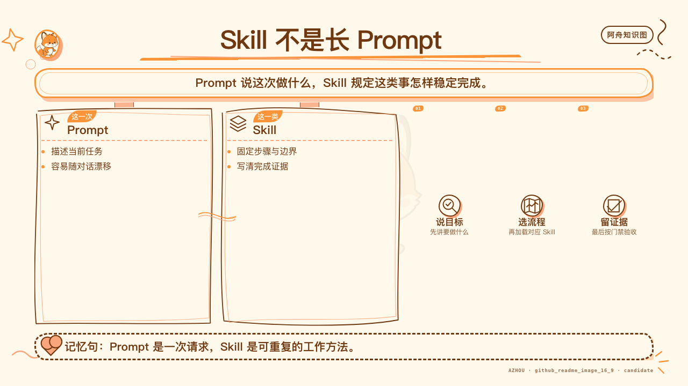

# Matt Pocock Skills Orange Book



A Chinese-first, beginner-friendly handbook for the public
[`mattpocock/skills`](https://github.com/mattpocock/skills) repository.

- [中文说明](README_zh.md)
- [Online reading edition](https://tefuirnever.github.io/matt-pocock-skills-orange-book/)
- [Authoritative Markdown book](book.md)
- [Generated HTML reading edition](html/index.html)

## What this repository contains

- A fixed-version explanation of all 37 upstream Skills.
- A step-by-step field guide for each Skill: trigger, input, process, boundary,
  teaching desktop UI example, output, verification, and beginner mistakes.
- Three explicit reading paths for beginner, intermediate, and advanced users.
- Seven progressive, synthetic desktop UI client exercises.
- Three end-to-end operation cases: fact-auditing a technical report, moving
  configuration semantics, and fixing an Electron renderer blank screen.
- Fifteen first-party evidence records from Matt Pocock's repository and
  official AI Hero pages, with version and inference boundaries.
- Six Azhou beginner diagrams as final PNG assets.
- Ten editable Excalidraw scenes with SVG and PNG exports.

The book is based on upstream commit
[`6654f6b60cd9d5be8b54c6fafe44346dabeb3b76`](https://github.com/mattpocock/skills/tree/6654f6b60cd9d5be8b54c6fafe44346dabeb3b76):
18 engineering, 7 productivity, 4 misc, and 8 in-progress Skills.

## Public boundary

Examples are purpose-built teaching scenarios. This repository does not contain
private project names, private source code, local user paths, credentials,
raw chat transcripts, or internal release information.

## Build and verify

```bash
npm ci
npm run check
```

The numbered files under `chapters/` are the authoritative content sources.
The build assembles them into `book.md`, generates both `html/index.html` and
`html/book.html`, and copies every referenced PNG into `html/assets/`.
The verifier checks 37/37 detailed Skill sections, all 16 chapter sources,
16+ book images, the fixed upstream commit, first-party evidence counts,
the Pages workflow, and common public-repository secret/path patterns.

## Visual sources

- `assets/azhou/`: final public PNG diagrams only. No private Skill runtime,
  prompt bundle, template, or machine receipt is included.
- `assets/diagrams/`: original `.excalidraw` scenes plus SVG and PNG exports.

## License

The upstream Skills remain under their MIT license. Original book text, HTML,
examples, and diagrams are licensed under CC BY-NC-SA 4.0. Embedded font
subsets retain their own licenses. See [THIRD-PARTY-NOTICES.md](THIRD-PARTY-NOTICES.md)
and [LICENSES](LICENSES). Project copyright and attribution scope are recorded
in [NOTICE.md](NOTICE.md).
