# Matt Pocock Skills 橙皮书

**从传统开发到 AI 协作开发：37 个 Skills 的心智模型、作者一手材料与 UI 客户端实战**

> 这不是一份命令清单。真正要学会的是：什么时候应该停下来问问题，什么时候应该做原型，什么时候必须先让测试变红，以及怎样把一次对话变成可跨会话交付的工程证据。


**版本基准**

| 项目 | 本书口径 |
|---|---|
| 上游仓库 | [`mattpocock/skills`](https://github.com/mattpocock/skills) |
| 固定提交 | [`6654f6b60cd9d5be8b54c6fafe44346dabeb3b76`](https://github.com/mattpocock/skills/tree/6654f6b60cd9d5be8b54c6fafe44346dabeb3b76) |
| 固定时间 | 2026-08-24 |
| 书稿核验 | 2026-09-01 |
| Skill 数量 | 37 个：engineering 18、productivity 7、misc 4、in-progress 8 |
| 目标读者 | 刚起步、已经在用、正在设计团队级 AI 工程流程的开发者 |
| 补充证据 | Matt Pocock 官网一手材料 |

本书不是 Matt Pocock 官方文档，也不代表原作者背书。Skill 的原始代码与文档采用 MIT License；本书原创讲解、图示和案例采用 CC BY-NC-SA 4.0。

---

## 目录

0. 这本书怎样读
1. Skill 到底是什么
2. 先看懂仓库，再安装
3. 写代码前：把模糊需求变成工程决策
4. 从对话到交付：规格、拆票、实现和评审
5. 反馈环：原型、TDD、诊断和研究
6. 代码不会自己变好：领域语言、深模块与双轴评审
7. 跨人、跨会话与人工步骤
8. 七个 UI 客户端实例，从浅到深
9. 把 Skills 引入自己的仓库
10. 新人四周训练路线
11. 37 个 Skills 逐项小白手册
12. Matt Pocock 本人怎样讲 Skills
13. 速查索引与资料声明

---

## 第 0 章 · 这本书怎样读

很多传统开发同学第一次接触 Skills，会自然地把它理解成新的脚手架、插件市场，或者一组更长的 Prompt。

这三个理解都只碰到表面。

Matt Pocock 这套仓库真正有价值的地方，是把几十年软件工程里已经被反复验证的做法，压缩成 Agent 可以按条件调用的小型工作纪律。它不替你掌控整个过程，也不承诺一键完成项目。它做的事更克制：当某类失败风险出现时，把最合适的反馈环装进当前对话。

### 0.1 先选路径，不必顺序读完

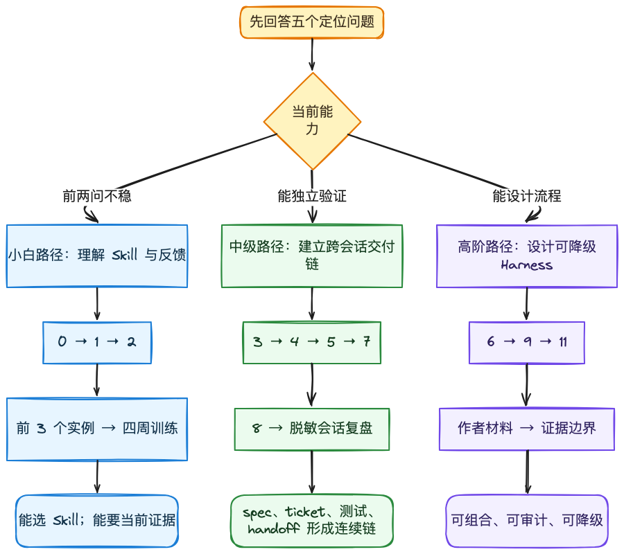

| 你现在是谁 | 先解决什么 | 建议顺序 | 读完应该能做什么 |
|---|---|---|---|
| 小白：还把 Agent 当聊天机器人 | 学会区分 Prompt、Skill、工具和项目规则 | 0 → 1 → 2 → 8 的前 3 个案例 → 10 | 选对第一个 Skill，能要求 Agent 留下验证证据 |
| 中级：已经能用 Agent 写功能 | 解决需求漂移、弱测试、疑难 bug 和跨会话失真 | 3 → 4 → 5 → 7 → 8 | 让 spec、ticket、测试和 handoff 组成连续工程链 |
| 高阶：正在带团队或建 Harness | 设计可组合、可审计、可降级的 Agent 工作流 | 6 → 9 → 11 → 12 → 13 | 把 Skill 改写成项目级流程，并用证据边界约束完成声明 |

如果你不知道自己是哪一档，用下面五个问题定位：

1. 你能否说清这次任务最可能怎样失败？
2. 你能否指出可重复运行的反馈命令？
3. 新会话不读旧聊天，还能否继续工作？
4. 你的 review 能否分开「代码是否合规」和「是否做对了需求」？
5. 某个工具或子 Agent 不可用时，流程还能否保留核心约束？

前两题还回答不清，从小白路径开始；前三题稳定后转入中级；能用真实证据回答全部五题，再进入高阶路径。

### 0.2 按问题直达章节

| 我现在遇到的问题 | 直接去哪里 |
|---|---|
| 不知道 Skill 与 Prompt、工具、`AGENTS.md` 有什么区别 | 第 1 章 |
| 装好后不知道怎样选 | 第 2 章和附录一页选型表 |
| Agent 还没问清就开始写 | 第 3 章 |
| 需求清楚，但一换会话就走样 | 第 4 章和第 7 章 |
| 测试很多，但 bug 总是复发 | 第 5 章 |
| 代码越生成越难改 | 第 6 章 |
| 想看从简单到复杂的完整示例 | 第 8 章 |
| 想把公开 Skill 改成自己团队的规则 | 第 9 章 |
| 想知道 Matt Pocock 本人怎样表述这套方法 | 第 12 章 |

### 0.3 本书采用的讲法

每一章都按同一顺序展开：

1. 先讲传统开发者最容易误判的地方。
2. 再解释对应 Skill 在解决什么失败风险。
3. 给一段可直接交给 Agent 的输入示例。
4. 说明应该留下什么产物和验证证据。
5. 最后列出常见失败与本章验收。

### 0.4 案例边界

书中的 UI 客户端案例全部是匿名化、合成化场景。它们保留常见工程问题，但不携带任何可识别的私有项目事实。

可以出现的内容：

- 设置页文案与多语言资源；
- 桌面客户端的 renderer、preload、main 进程；
- 通用 Provider 配置与公共接口；
- 定时任务面板、错误状态与重试；
- 测试、类型检查、构建和评审结果。

不会出现的内容：

- 私有项目名、内部仓库地址和用户本机路径；
- 未公开模块名、协议名、接口、事件或源代码；
- 能反推出产品路线、客户、账号、密钥或发布状态的细节。

### 0.5 证据口径

本书把证据分成三层：

| 层级 | 能证明什么 | 不能证明什么 |
|---|---|---|
| 上游固定提交 | Skill 在该提交里的真实文本和结构 | 后续版本仍然相同 |
| 官网作者表述 | Matt Pocock 在检索日当时公开怎样讲这套方法 | 这些表述已经出现在固定提交中，或他为本书背书 |
| 当前验证 | 当前代码、当前分支、当前命令的结果 | 下一次改动仍然会通过 |

历史成功不等于当前通过。一个旧会话里跑绿的测试，不能为今天的分支背书。

### 0.6 本章验收

- 能说清本书主角是公开的 Matt Pocock Skills 仓库。
- 能说清匿名实例是教学载体，不是私有项目案例披露。
- 能区分固定上游事实、后续官网表述和当前验证。
- 能根据自己的经验选择小白、中级或高阶路径。

---

## 第 1 章 · Skill 到底是什么

### 1.1 Skill 不是更长的 Prompt

普通 Prompt 往往只描述一次任务：改一个页面、修一个 bug、写一段测试。

Skill 描述的是可重复使用的工作方法：

- 什么情况下应该触发；
- 开始前需要读什么；
- 按什么顺序行动；
- 哪些步骤不能跳过；
- 完成时必须留下什么证据；
- 哪些情况应该停下来，把决定交还给人。

可以把它理解成 Agent 的标准作业程序，但它比传统 SOP 更贴近上下文：Agent 会结合当前仓库、对话和工具，把方法落到具体任务上。

### 1.2 一个最小 Skill 的四个问题

无论 Skill 文件多长，都应该回答四个问题：

| 问题 | 例子 |
|---|---|
| 什么时候触发 | 用户报告难复现的性能退化 |
| 第一步做什么 | 先建立能捕获该症状的红色反馈环 |
| 中间怎样约束 | 每次只改变一个变量，假设必须可证伪 |
| 怎样才算完成 | 回归测试变绿，临时埋点被清理，当前命令重新运行 |

如果一份所谓 Skill 只写了角色、语气和宏大目标，却没有可判断的完成条件，它更接近人格 Prompt，不是可靠的工程能力。

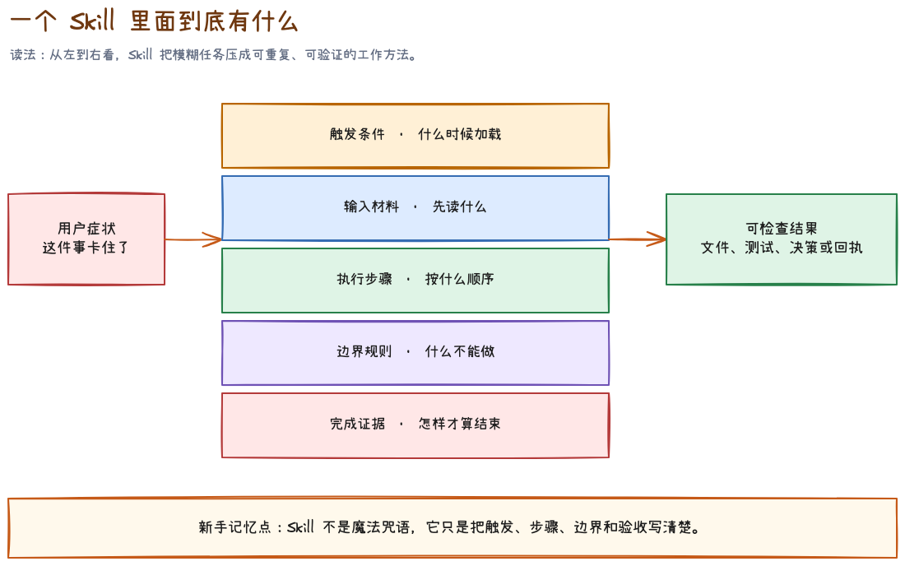

对刚接触 Skill 的同学，更实用的读法是把一个 `SKILL.md` 拆成五层：

1. **触发层**：frontmatter 里的 `description` 以及正文开头，决定它在什么症状下应该被加载。
2. **输入层**：开始前必须读取的文件、当前对话、issue、spec、测试命令或外部资料。
3. **步骤层**：Agent 必须按什么顺序做事，哪些步骤可以并行，哪些步骤必须等待前置决定。
4. **边界层**：禁止事项、权限边界、隐私要求、工具缺失时的降级方式。
5. **证据层**：什么文件、命令结果、决策或回执出现后，才能说这次运行结束。

一个 Skill 文件夹里还可能有 `references/`、`scripts/`、模板或示例。它们不是装饰。`SKILL.md` 应该保留主路径，把只有某个分支才需要的材料放到引用文件里。这叫渐进披露：先让 Agent 看见“何时需要什么”，再按条件读取细节，避免每次对话都背着整个手册。

#### frontmatter 小白词典

| 字段 | 可以怎么理解 | 新手要检查什么 |
|---|---|---|
| `name` | Skill 的稳定名字 | 文件夹名、调用名和文档是否一致 |
| `description` | 路由标签 | 是否同时写清能力与触发场景，而不是只写“很有用” |
| `argument-hint` | 用户输入提示 | 是否告诉用户需要补什么上下文 |
| `disable-model-invocation: true` | 只允许用户显式发起 | 是否适合会改变流程、创建大量产物或需要用户持续参与的能力 |

`disable-model-invocation` 不是能力等级。它只是控制“谁有权启动”。例如 `grill-me` 会进入多轮访谈，应该由用户明确发起；`tdd` 是实现内部的工程纪律，可以由 Agent 在合适场景主动加载。

### 1.3 小而可组合，比接管全流程更重要

上游 README 明确反对让一套方法论完全接管流程。原因很现实：流程越大，内部错误越难定位，使用者也越难保留控制权。

这套仓库选择了另一条路：

- `grill-me` 只负责把想法问清楚；
- `to-spec` 只负责把已经确定的对话写成规格；
- `to-tickets` 只负责把规格拆成有阻塞关系的垂直切片；
- `implement` 只负责按已经批准的规格施工；
- `code-review` 只负责按 Standards 与 Spec 两条轴验收。

每个 Skill 都有边界。边界清楚以后，组合才不会变成一团自动化黑箱。

### 1.4 两种调用方式

这个仓库按一个关键轴区分 Skills：谁可以调用它。

| 类型 | 谁触发 | 典型职责 | 例子 |
|---|---|---|---|
| User-invoked | 用户显式输入 | 编排一次完整工作阶段 | `grill-me`、`to-spec`、`implement` |
| Model-invoked | 用户或 Agent 按任务匹配 | 提供可复用的工程纪律 | `tdd`、`diagnosing-bugs`、`codebase-design` |

这条区分解决了一个常见问题：如果 Agent 可以自动启动任何大型流程，它很容易在用户只想问一句话时开一场漫长仪式。让编排型 Skill 由用户显式触发，能保留控制权；把 TDD、诊断、领域建模这类纪律交给模型按需调用，又能减少重复指挥。

### 1.5 从失败风险反推 Skill

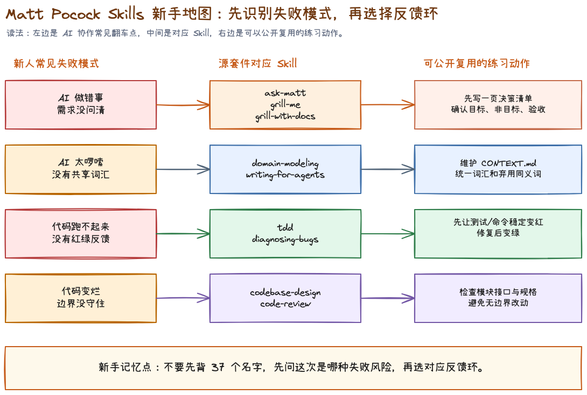

不要先背 37 个名字。先问这次最可能怎样失败。

| 失败风险 | 优先考虑 |
|---|---|
| 做出的东西不是用户想要的 | `ask-matt`、`grill-me`、`grill-with-docs` |
| 团队和 Agent 对词汇理解不同 | `domain-modeling`、`writing-for-agents` |
| 代码看似完成但无法稳定验证 | `tdd`、`diagnosing-bugs` |
| 功能越做越难改 | `codebase-design`、`improve-codebase-architecture` |
| 代码规范但做错了需求 | `code-review` 的 Spec 轴 |
| 需求明确但跨会话失真 | `to-spec`、`to-tickets`、`handoff` |

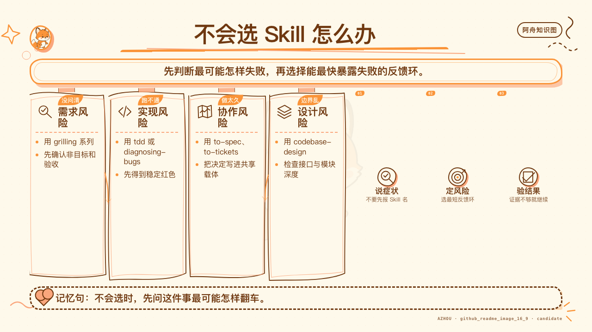

### 1.6 本章验收

- 能用自己的话解释 Skill 与一次性 Prompt 的区别。
- 能区分 user-invoked 与 model-invoked。
- 面对任务时先判断失败风险，而不是先选最强、最长的流程。

---

## 第 2 章 · 先看懂仓库，再安装

### 2.1 四个目录，不是同一种稳定性

固定提交中共有 37 个 `SKILL.md`：

| 目录 | 数量 | 定位 | 使用态度 |
|---|---:|---|---|
| `engineering` | 18 | 日常软件工程主线 | 重点学习 |
| `productivity` | 7 | 通用思考、交接、教学与文档 | 按场景组合 |
| `misc` | 4 | 作者特定工具与仓库设置 | 先判断是否匹配本项目 |
| `in-progress` | 8 | 正在演化的实验能力 | 只做试验，不当稳定接口 |

一个容易踩的坑，是看到目录里存在 Skill，就默认它已经稳定。`in-progress` 的名字、行为和存在性都可能变化，书中会完整列出，但不会把它们塞进新人主链。

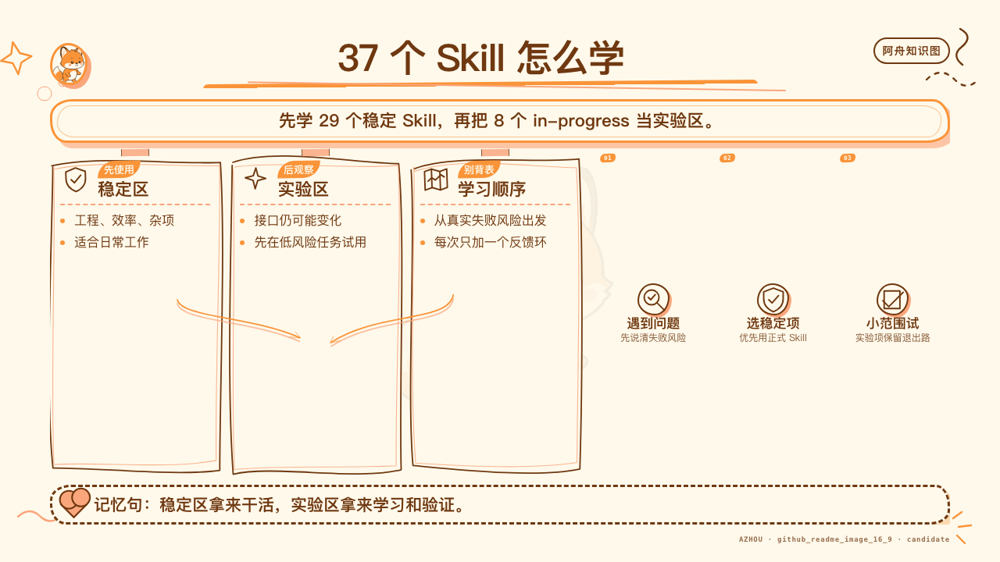

### 2.2 两种安装哲学

上游提供两条主要路径：

#### Claude Code 插件

```bash
claude plugins install mattpocock-skills
```

它安装整个托管、只读的集合。优点是更新方便，代价是你订阅的是上游版本，不是项目自己的改编版。

#### skills.sh 安装

```bash
npx skills@latest add mattpocock/skills
```

它把选中的 Skill 复制到项目里。优点是可以修改、审查和版本化，代价是更新需要自己管理。

不要同时走两条路径。重复安装会让同名 Skill 出现两份，触发和维护都会变得模糊。

### 2.3 第一次必须做 setup

安装后，优先运行：

```text
/setup-matt-pocock-skills
```

它会配置三件事：

1. issue tracker 在哪里；
2. triage 使用哪些标签；
3. 领域文档放在哪里。

这一步的价值不在生成几个文件，而在把 Skill 与仓库现实连接起来。没有 tracker 配置，`to-spec` 和 `to-tickets` 不知道往哪里发布；没有领域文档位置，`domain-modeling` 和下游任务就没有共同语言。

### 2.4 `ask-matt` 是路由器

刚开始不需要记住全部 Skill。可以把任务原样交给 `ask-matt`：

```text
/ask-matt

我要给桌面客户端新增一个 Provider 设置页。
产品方向大致确定，但错误状态、凭据保存方式和测试边界还没想清楚。
这项工作可能跨多个会话，我应该走哪条流程？
```

一个合理的路由不是直接回答「用 implement」，而是根据未决问题推荐：先 `grill-with-docs`，必要时做 `prototype`，决策稳定后 `to-spec`，再根据规模决定是否 `to-tickets`。

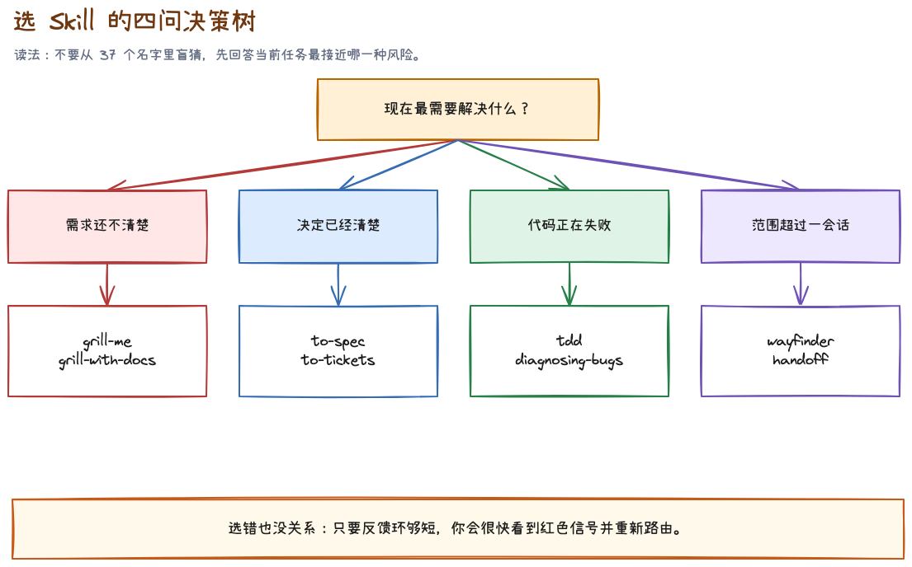

### 2.5 三档使用强度

| 任务规模 | 推荐链路 | 不该做的事 |
|---|---|---|
| 小改动 | 直接实现，按需调用 `tdd` 或 `code-review` | 为改一个字写十页规格 |
| 中等功能 | `grill-with-docs` → `to-spec` → `implement` | 边写边重新设计 |
| 大型工作 | `wayfinder` → 决策 tickets → `to-spec` → `to-tickets` → 多次 `implement` | 试图把所有上下文塞进一个会话 |

### 2.6 本章验收

- 能说出四个目录的稳定性差异。
- 知道 Claude Code 插件与 skills.sh 不应重复安装。
- 能解释 setup 为什么是仓库级配置，不是形式步骤。
- 遇到选型困难时先用 `ask-matt`，而不是盲猜。

---

## 第 3 章 · 写代码前：把模糊需求变成工程决策

### 3.1 `grill-me`：答案在你脑子里

`grill-me` 适合不依赖代码库的想法。它会把主题建模成一棵决策树，逐轮询问当前已经可以回答的前沿问题。

适合：

- 产品方向；
- 功能范围；
- 交互取舍；
- 团队流程；
- 文章或课程结构。

不适合：

- 答案在代码或官方文档里，却让用户凭记忆回答；
- 已经做完决定，只需要整理成规格；
- 用户只想听一个简短解释。

示例输入：

```text
/grill-me

我想做一个定时任务推荐面板。
用户可以看到推荐理由、下一次运行时间和启用状态，
但我还没决定它应该和现有任务列表放在一起还是分开。
```

好的结果不是 Agent 替你设计完页面，而是未决树被逐步清空：目标用户是谁、首屏最重要的信息是什么、推荐如何被采纳、失败状态怎样表达、哪些内容明确不做。

### 3.2 `grilling`：底层提问原语

`grilling` 是 `grill-me`、`grill-with-docs`、`wayfinder` 等 Skill 背后的提问纪律。

它有两条重要规则：

- 环境和代码里能查到的事实，由 Agent 自己查；
- 产品取舍、风险偏好和业务决策，必须由人决定。

如果 Agent 问「仓库用什么测试框架」，它是在把事实调查甩给你；如果 Agent 擅自决定「失败任务自动重试三次」，它是在替你做业务决定。两者都越界。

### 3.3 `grill-with-docs`：边问边沉淀共同语言

当问题发生在真实代码库里，优先使用 `grill-with-docs`。它不只提问，还会在决定形成时更新：

- `CONTEXT.md` 中的领域术语；
- `docs/adr/` 中少量真正值得长期保存的架构决策。

这里的关键是 inline：术语一旦定下来就立即写，不要等会话结束再凭记忆补。

#### 一个通用 UI 场景

团队里有人说「保存 Provider」，有人说「连接账号」，有人说「启用模型」。这三个动作可能完全不同：

- 保存配置只写本地状态；
- 连接账号需要验证凭据；
- 启用模型会改变运行时选择。

如果这些词没有先分清，组件名、函数名、测试名和产品文案都会互相污染。`domain-modeling` 会要求把词压到可以用边界案例检验的程度。

### 3.4 ADR 不是开发日记

只有同时满足三条，才值得写 ADR：

1. 决定难以逆转；
2. 没有上下文会让未来读者惊讶；
3. 存在真实取舍。

「按钮放右边」通常不值得 ADR。「凭据只通过系统安全存储访问，renderer 永远拿不到明文」可能值得，因为它跨越安全边界，未来也容易被误改。

### 3.5 决策已经完成时，不要继续 grill

如果目标、边界、用户故事和测试接缝都已经确定，再开一轮拷问只会制造重复讨论。这时应该进入 `to-spec`。

选择口诀：

| 当前状态 | 下一步 |
|---|---|
| 想法模糊，答案在自己脑子里 | `grill-me` |
| 想法模糊，且需要读仓库和维护术语 | `grill-with-docs` |
| 决策已完成，需要形成可交付文档 | `to-spec` |
| 一个会话容纳不了全部决策 | `wayfinder` |

### 3.6 本章验收

- 不会让 Agent 问可以从仓库查到的事实。
- 不会让 Agent 替人做业务取舍。
- `CONTEXT.md` 只保存术语，不膨胀成规格书。
- ADR 只记录高成本、反直觉、存在取舍的决定。

---

## 第 4 章 · 从对话到交付：规格、拆票、实现和评审

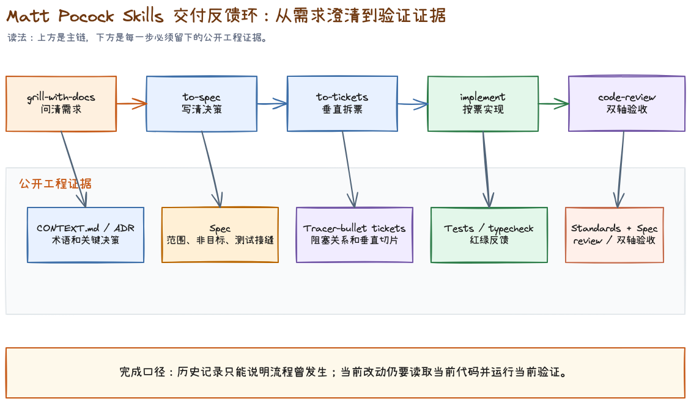

### 4.1 `to-spec`：记录已经做完的决定

`to-spec` 不负责采访。它应该读取当前对话，把已经确定的内容整理成：

- Problem Statement；
- Solution；
- 编号 User Stories；
- Implementation Decisions；
- Testing Decisions；
- Out of Scope；
- Further Notes。

它在写规格前会确认测试接缝。上游强调优先复用已有接缝，尽量选择最高层、最少数量的公共边界。理想接缝数量甚至可以是一条。

为什么规格里要写测试接缝？因为没有这一步，下一会话很可能把内部函数当接口测试，或者为了好测而到处切新接口，最后测试很多，设计更差。

### 4.2 `to-tickets`：按垂直切片拆，不按技术层拆

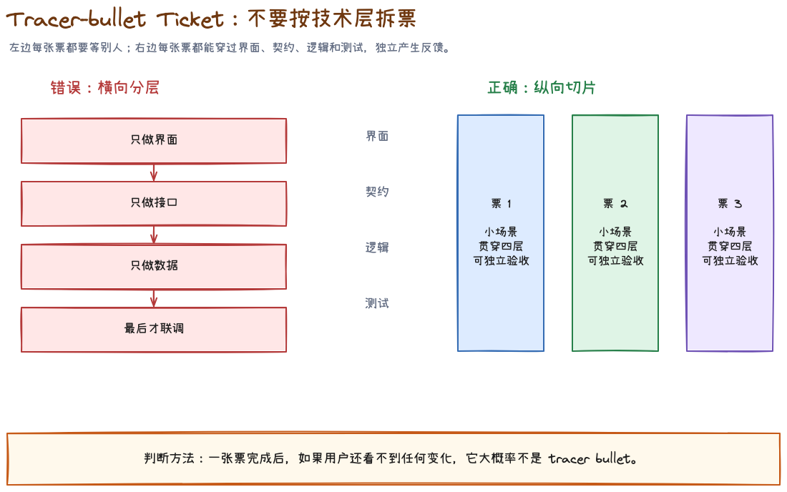

错误拆法：

1. 先完成所有数据结构；
2. 再完成所有 main 进程逻辑；
3. 再完成所有 renderer 页面；
4. 最后统一补测试。

这种横向拆法的问题是，前三张票关闭时都没有可演示的用户价值，也没有端到端反馈。

更好的 tracer-bullet 拆法：

1. 用户可以新增一条最小 Provider 配置，并在重启后看到它；
2. 用户可以验证凭据，看到成功与失败状态；
3. 用户可以设为默认，并在一次真实请求里使用；
4. 用户可以删除配置，运行时安全回退。

每张票都穿过必要层级，但只做一条细而完整的行为。

### 4.3 宽范围机械改动是例外

如果一次共享类型重命名会让几千个调用点同时变红，硬拆垂直切片并不现实。`to-tickets` 对这类 wide refactor 推荐 expand–migrate–contract：

1. Expand：新旧形式并存，保持兼容；
2. Migrate：按包或目录分批迁移；
3. Contract：确认旧调用归零后删除旧形式。

这个例外很重要。方法论不是教条，垂直切片的目的始终是让反馈保持有效。

### 4.4 `implement`：施工阶段不重开产品讨论

`implement` 接收已经批准的 spec 或 tickets。它应该：

- 按预先约定的 seam 使用 `tdd`；
- 一次实现一张 ticket；
- 持续运行类型检查和目标测试；
- 完成后调用 `code-review`；
- 在当前分支提交结果。

它不应该边实现边 redesign。出现新的产品决策时，应停下来上报，而不是悄悄选一个答案继续写。

### 4.5 `code-review`：规范正确与需求正确是两件事

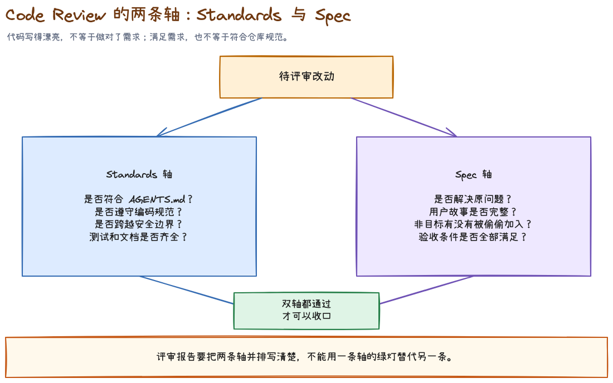

这套 `code-review` 把评审拆成两条隔离的轴：

| 轴 | 核心问题 | 证据 |
|---|---|---|
| Standards | 代码是否遵守仓库规范与坏味道基线 | 编码规范、diff、测试与设计信号 |
| Spec | 代码是否实现了原始需求 | issue/spec、验收标准、行为证据 |

一段代码完全可能写得优雅，却解决了错误的问题；也可能功能正确，却以高耦合和重复代码实现。两条轴不能揉成一个模糊的总分。

### 4.6 `wayfinder`：一个会话装不下时，先画决策地图

大工程的瓶颈通常不是代码量，而是未决问题太多。`wayfinder` 会建立一张由决策 tickets 组成的地图：

- grilling ticket：通过讨论决定；
- prototype ticket：必须做出可交互东西才能决定；
- research ticket：需要一手资料；
- task ticket：需要人完成外部动作。

地图清空以后，再用 `to-spec` 把散落的决定收拢成统一规格。它不是直接把地图变成实现票。

### 4.7 本章验收

- 规格只记录已确定内容，不在写作阶段偷偷补产品决定。
- tickets 默认是 tracer-bullet 垂直切片。
- wide refactor 用 expand–migrate–contract，而不是强行端到端。
- 实现阶段遇到新决策会回报，不会自行 redesign。
- 评审同时覆盖 Standards 与 Spec，但不混成一个结论。

---

## 第 5 章 · 反馈环：原型、TDD、诊断和研究

### 5.1 `prototype`：写代码只是为了回答问题

原型不是简陋版产品。它的验收标准不是代码质量，而是有没有回答那个设计问题。

上游区分两类：

| 问题 | 产物 |
|---|---|
| 状态模型或逻辑是否合理 | 可双击打开的单文件 HTML |
| UI 结构应该选哪种 | 同一路由下多个结构明显不同的变体 |

原型通常不需要生产级错误处理、抽象和测试。加这些东西不会增加学习，反而拖慢反馈。

原型要非常容易启动。一个逻辑 demo 双击即可打开；一个 UI 原型只需要一条项目任务命令。

### 5.2 `tdd`：红到绿，不是先写一堆测试

这套 TDD 的循环非常窄：

1. 在预先同意的公共 seam 写一个失败测试；
2. 运行它，确认因为目标行为缺失而变红；
3. 只写足够让这个测试变绿的实现；
4. 再进入下一个行为。

它明确反对三类测试：

- 实现耦合：测试私有方法或 mock 内部协作者；
- 同义反复：测试用和实现一样的算法计算期望值；
- 横向批量：先写完所有测试，再一次性实现。

Mock 只应该放在系统边界，例如外部 API、时钟、随机数。不要 mock 自己的模块来制造假绿。

上游当前版本把 refactor 从红绿循环中移出，交给 review 阶段。这一点和经典 Red-Green-Refactor 口号不同，使用时要以固定提交里的真实 Skill 文本为准。

### 5.3 `diagnosing-bugs`：没有红色命令，不进入理论阶段

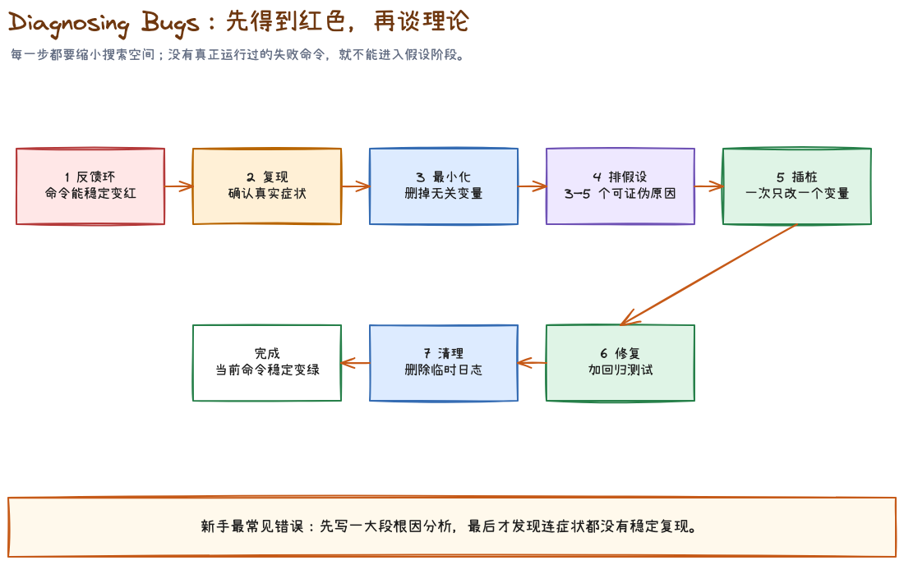

这是仓库里最鲜明的纪律之一。

面对疑难 bug，很多 Agent 会先读代码，十分钟后列出一个听起来合理的根因。`diagnosing-bugs` 强行把顺序反过来：先找到一条能够捕获用户精确症状的命令。

反馈环可以是：

1. failing test；
2. curl 脚本；
3. CLI + 固定输入；
4. 无头浏览器；
5. 捕获并重放请求或事件；
6. throwaway harness；
7. `git bisect run`；
8. 最后才是结构化的人机协作脚本。

进入下一阶段前，这条命令必须已经实际运行过，并且具备 red-capable：它能因为这个具体 bug 失败，而不是只证明程序没有崩溃。

之后的顺序是：

1. Reproduce + minimise；
2. 生成 3–5 个排序后的可证伪假设；
3. 每次只改变一个变量进行 instrument；
4. 修复并把最小复现固化成回归测试；
5. 清理临时日志和辅助代码。

### 5.4 隐私与调试证据

诊断 Skill 会展示命令、输出和捕获产物，因此先脱敏是硬要求：

- secret 替换为 `<REDACTED>`；
- 凭据留在环境变量；
- 只引用携带信号的日志行；
- HAR、trace、截图在提交前检查认证头与个人数据。

### 5.5 `research`：外部事实卡住决定时，用一手来源

当问题不在仓库，而在第三方 SDK、协议、版本声明或官方 API 时，应该进入 research：

- 只用官方文档、规范、源码、官方 API 等高可信一手来源；
- 每个材料性论断附链接；
- 产出 Markdown 调研文件；
- 明确核验日期、版本和未知项。

调研文件容易过期。是否长期保留，应看它是不是规格或 ADR 的长期依赖；不是的话，短期证据比陈旧常驻文档更安全。

### 5.6 本章验收

- 原型只有一个明确问题，并且启动成本极低。
- TDD 测公共 seam，不测内部实现。
- 疑难 bug 在形成理论前已经存在 red-capable 命令。
- 调试证据完成脱敏。
- 外部技术事实优先查一手来源，并标注版本与日期。

---

## 第 6 章 · 代码不会自己变好：领域语言、深模块与双轴评审

### 6.1 `domain-modeling`：共同语言不是术语装饰

领域语言会直接影响：

- 用户和 Agent 是否在讨论同一件事；
- 文件、变量和函数是否使用一致名称；
- 搜索是否能快速命中；
- 测试描述是否表达真实行为；
- spec 和代码之间是否存在翻译损耗。

`CONTEXT.md` 应该像词典：每个词一两句话，必要时记录废弃同义词。它不保存实现细节，不承担规格书、scratchpad 或会议纪要的职责。

### 6.2 `codebase-design`：深模块的共享词汇

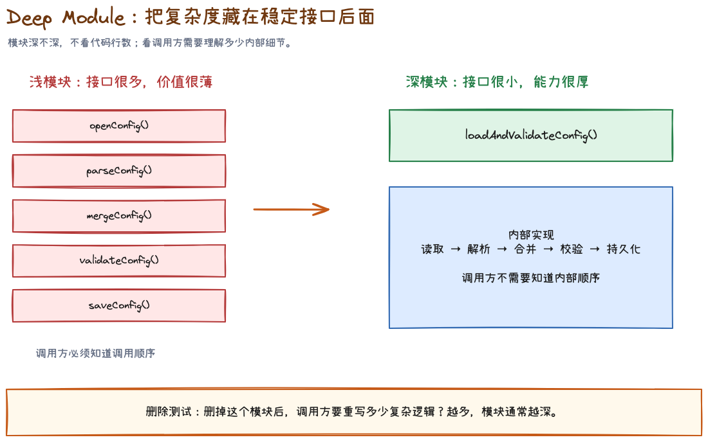

这个 Skill 更像设计词典，不是直接执行的流程。它建立一组精确术语：

- module；
- interface；
- depth；
- seam；
- adapter；
- leverage；
- locality。

核心判断是深度：一个好模块用小接口隐藏大量复杂行为。

#### 删除测试

想象删掉这个模块：

- 如果复杂度也一起消失，它可能只是无价值的传话筒；
- 如果复杂度散落到许多调用方，它确实在集中管理复杂性。

#### 一个适配器不一定构成真实 seam

只有一个实现时，抽象可能只是预测未来。出现两个需要变化的适配器，才说明 seam 真正存在。不要为了可替换性口号提前造接口。

### 6.3 `improve-codebase-architecture`：先做候选调查，不直接大改

这个流程会：

1. 读取 `CONTEXT.md` 和相关 ADR；
2. 寻找浅模块、泄漏 seam、重复知识和难测试区域；
3. 生成可视化 HTML 候选报告；
4. 让用户选择一个候选；
5. 再用 `grilling` 探索如何加深模块。

它不会在报告阶段直接设计新接口，也不会把每个理论重构都列出来。架构改进必须由当前真实摩擦推动。

### 6.4 `code-review`：坏味道与规格偏差都要能指向证据

好的 review finding 应该包含：

- 严重级别；
- 具体文件和位置；
- 可触发的支持输入或使用路径；
- 为什么违反标准或规格；
- 最小修复方向；
- 缺少什么测试。

「代码可以更优雅」不是 finding。「删除 Provider 后默认选择仍指向不存在的 id，下一次启动会进入不可恢复状态」才是可行动问题。

### 6.5 `resolving-merge-conflicts`：解决意图，不是选择文本

冲突两侧都可能是正确改动。处理每个 hunk 前应该读取：

- 对应 commit 信息；
- PR 或 issue；
- 两边的测试与文档；
- 当前 merge/rebase 的目标。

禁止整批使用 `--ours` 或 `--theirs`。那只能保证语法上快速消除标记，不能保证任何一侧的意图被保留。

冲突解决完成后，要继续完成 merge/rebase，并运行项目的类型检查、测试和格式化。冲突消失不等于合并正确。

### 6.6 本章验收

- `CONTEXT.md` 保持词典边界。
- 能用 module、interface、depth、seam 等精确词讨论设计。
- 只有真实摩擦才进入架构候选，不做理论重构。
- review finding 能指向具体行为和证据。
- merge conflict 按两侧意图解决，不整批选边。

---

## 第 7 章 · 跨人、跨会话与人工步骤

### 7.1 `handoff`：工作真的需要旅行时再用

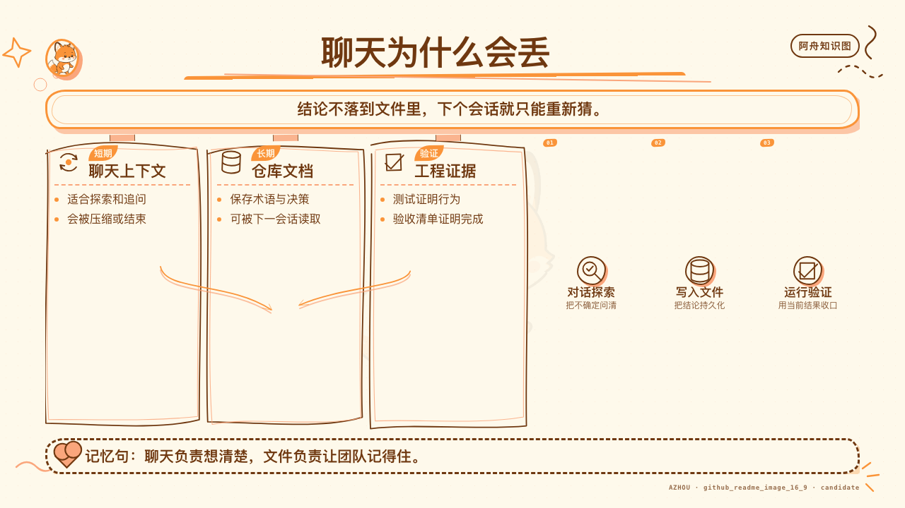

`handoff` 把当前对话压缩成临时目录中的交接文档，供新 Agent 或新工具接手。

它只保留活着的线索：

- 当前目标；
- 已做决定；
- 未完成步骤；
- 关键路径；
- 已有文档和 commit 的指针；
- 风险与阻塞。

已经存在于 spec、ADR、ticket 或 commit 里的内容只留路径，不整段复制。密钥必须脱敏。

如果只是继续当前对话，不需要 handoff；如果全部方向作废，应该清空上下文；如果只是一个独立子问题，应该用子 Agent。不要把 handoff 当日常总结模板。

### 7.2 `to-questionnaire`：答案在别人脑子里

有些决定不能靠 Agent 查，也不在你脑子里。例如：

- 客户愿意接受什么迁移窗口；
- 法务对数据保留有什么要求；
- 领域专家怎样定义异常状态；
- 运维团队能提供什么部署权限。

`to-questionnaire` 会先问清收件人和你需要拿回的决定，再生成按重要性排序的 Markdown 问卷。每题只问一件事，允许回答不知道，并以「还有什么我们应该问但没问」收尾。

### 7.3 `wizard`：只把人才能做的步骤交给人

当流程卡在第三方控制台、凭据、CI secret、一次性迁移或 cutover 时，`wizard` 生成交互式 Bash 脚本引导人完成。

安全边界很关键：Agent 只写脚本，不运行脚本。这样 secret 不会进入 Agent 上下文。脚本可以：

- 打开官方页面；
- 指示点击位置；
- 以不回显方式读取 token；
- 写入 `.env` 或 secret store；
- 支持中断后重跑。

普通文件编辑、测试运行和本地配置如果 Agent 自己能做，不应该伪装成人工步骤推给用户。

### 7.4 `teach`：文件夹才是跨会话记忆

`teach` 把一个目录变成长期教学工作区：

- `MISSION.md` 记录为什么学；
- `RESOURCES.md` 保存高可信资料；
- `lessons/` 保存每节 HTML 课程；
- `reference/` 保存真正会反复查的速查材料；
- `learning-records/` 决定下一节教什么。

它区分阅读时的流畅感与长期存储强度，通过检索练习、间隔和交错来建立后者。课程内容不应该只依赖模型记忆，而要被可信资料和引用约束。

### 7.5 `wait-what`：理解断线时，让 Agent 退回前提

这个 Skill 很短，但用途明确：上一条消息没讲明白时，要求 Agent 用缺失上下文、项目词汇和更直白的例子重讲。

它不是「再简短一点」。有时越短越难懂。它表达的是读者在某个前提处掉线，需要重建桥梁。

### 7.6 `writing-for-agents`：精确比解释更重要

写给 Agent 的文档有两个负担：

| 负担 | 含义 | 常见问题 |
|---|---|---|
| Context load | 每轮都常驻上下文的 token 与注意力成本 | `AGENTS.md` 越写越长 |
| Cognitive load | 人需要记住在哪里找什么 | 指针太少，规则散落无人知道 |

解决办法不是把所有内容塞进根文档，而是建立锋利的 context pointer：一行说明资料是什么、什么时候必须读取。

它还强调 leading words 和 no-op 测试：如果删掉一句话，模型行为不会变化，那句话就是负担；如果一个紧凑术语可以稳定唤起完整做法，就用术语替代反复解释。

### 7.7 本章验收

- 只有跨会话或跨工具时才 handoff。
- 答案在别人脑子里时使用 questionnaire，而不是让 Agent 猜。
- secret 由人工向导安全收集，不进入聊天上下文。
- 长期教学依赖工作区文件，不依赖模型自称记得。
- Agent 文档使用精确指针，并定期删除 no-op 指令。

---

## 第 8 章 · 七个 UI 客户端实例，从浅到深

以下案例使用一个匿名桌面 AI 客户端作为教学背景。它有 renderer、preload、main 进程，支持多语言、Provider 配置和定时任务。所有名字、数据和代码均为公开可复现的合成示例。

### 实例一：设置页改一个文案

#### 任务

把设置页按钮从「保存」改成「保存并验证」，所有语言保持一致。

#### 传统开发的自然反应

全文搜索中文，找到 JSX，直接改字。

#### AI 协作里的风险

- 文案可能来自 i18n key，不在组件里；
- 不同 locale 可能漏改；
- 按钮行为没有验证逻辑，文案会承诺不存在的能力；
- 测试可能只断言旧 key。

#### Skill 选择

这是小改动，不需要完整规格链。先确认需求真实含义，必要时用 `ask-matt`；实现时使用项目既有验证，不启动 `wayfinder`。

#### 推荐输入

```text
请先定位按钮文案来源和现有点击行为。
确认“保存并验证”是否已经有对应验证动作；如果没有，停止并说明这是功能变化，不是纯文案变化。
如果行为已经存在，只修改语义 key 和所有 locale，并运行最小 i18n 检查。
```

#### 应留下的证据

- 被修改的语义 key；
- locale 完整性检查；
- 目标组件或交互测试；
- 没有新增硬编码用户文本的扫描结果。

#### 验收

- 文案与真实行为一致；
- 所有受支持语言均有值；
- 当前检查重新运行，而不是引用旧日志。

### 实例二：先做定时任务推荐面板原型

#### 任务

团队还没决定推荐项应该和现有任务列表并排，还是单独放在顶部。

#### 错误做法

直接进入产品代码，接真实任务数据，补状态管理和错误处理，然后让产品在接近完成时选布局。

#### Skill 选择

问题是「哪种结构更容易理解」，不是「怎样写生产代码」。使用 `prototype`。

#### 原型问题

```text
我们只需要回答一个问题：
推荐任务与现有任务，是并排比较更清楚，还是先处理推荐再进入列表更清楚？

请在同一路由提供三个结构明显不同的变体：
1. 左右双栏；
2. 顶部推荐带 + 下方任务表；
3. 统一列表，用来源标签区分。

使用固定假数据，不接真实 API，不进入生产状态管理。
```

#### 应留下的证据

- 一条启动命令；
- 三个结构差异足够大的变体；
- 评审人选择与理由；
- 被淘汰方案的关键失败点；
- 一条可以写进 spec 的明确决定。

#### 验收

原型回答了结构问题就结束。不要因为代码看起来能用，就直接合并到主分支。

### 实例三：推理强度保存后被重置

#### 症状

用户把某个 Provider 的推理强度设为 high，界面当下显示正确；重启客户端后恢复为 medium。

#### 错误做法

先搜索 `reasoning`，看到一个默认值，就把 medium 改成 high。

#### Skill 选择

使用 `diagnosing-bugs`。这类问题可能发生在 renderer state、IPC payload、main 持久化、schema 默认值或反序列化任一环节。没有反馈环时，任何理论都只是猜。

#### 建立 red-capable 命令

```text
目标症状：通过公共设置接口保存 high，重建应用状态后读取，得到 medium。

先写一条最小集成测试，只穿过公开设置接口：
1. 创建临时配置目录；
2. 保存 reasoningEffort=high；
3. 销毁并重新创建配置服务；
4. 读取同一 Provider；
5. 断言仍为 high。

运行目标测试，确认当前实现因实际症状失败后，再列假设。
```

#### 排序假设示例

1. 写入 schema 未包含该字段，因此序列化时丢失；
2. IPC contract 接收字段，但 main 侧映射遗漏；
3. 读取 schema 把合法 high 误判为未知值并回退；
4. renderer 重启后读取了另一份配置作用域。

每个假设都要有预测。例如假设 1 的预测是：磁盘文件中不存在 `reasoningEffort`，但 IPC 请求载荷存在。

#### 验收

- 目标命令先红后绿；
- 最小复现成为回归测试；
- 一次只验证一个假设；
- 临时日志全部清理；
- 不把默认值修改伪装成持久化修复。

### 实例四：新增一个 Provider 垂直切片

#### 任务

新增一个需要 API key 的 Provider，用户可以保存、验证、设为默认并删除。

#### 为什么不能直接 implement

至少有这些未决问题：

- key 存在哪里；
- renderer 是否能读取明文；
- 验证失败有哪些可区分状态；
- 删除默认 Provider 后怎样回退；
- 离线时能否保存但暂不验证；
- 测试 seam 是设置服务、IPC contract 还是端到端 UI。

#### Skill 链

```text
grill-with-docs
  → 必要时 prototype
  → to-spec
  → to-tickets
  → implement（一张票一个会话）
  → code-review
```

#### 规格中的关键内容

```markdown
## User Stories

1. As a user, I can save a Provider credential without exposing its plaintext to the renderer.
2. As a user, I can verify the credential and see distinct invalid, offline, and server-error states.
3. As a user, I can make a verified Provider the default.
4. As a user, deleting the default Provider selects a valid fallback or returns to an unconfigured state.

## Testing Decisions

- Primary seam: public Provider settings service.
- Contract coverage: typed request/response schema.
- UI coverage: one happy path and three user-visible failure states.

## Out of Scope

- Provider-specific billing UI.
- Automatic key rotation.
- Import from other clients.
```

#### Tracer-bullet tickets

1. 保存最小配置并在重启后读取；
2. 验证凭据并显示区分后的结果；
3. 设为默认并用于一次请求；
4. 删除默认项并安全回退。

每张票都包含一个用户可观察行为，不按 renderer/main/test 横向拆。

#### 验收

- 规格中有明确 seam 与 out-of-scope；
- 每张票都可单独演示；
- secret 不进入日志、截图和聊天；
- Standards 与 Spec 两条 review 轴分别给出结论。

### 实例五：把配置模块做深

#### 症状

新增任何 Provider 都要同时修改六个文件：默认值、序列化、验证、UI 映射、删除回退和测试 fixture。调用方知道过多内部规则。

#### Skill 选择

先用 `improve-codebase-architecture` 形成候选，不直接重构。讨论时使用 `codebase-design` 的精确词汇。

#### 候选描述

```text
当前配置 module 很浅：
它的 interface 暴露存储格式、默认值选择和删除回退，
调用方需要重复维护同一组不变量。

候选方向：
把 Provider 生命周期规则放进一个更深的 module，
对外只暴露 register、verify、selectDefault、remove 四个行为。
```

#### 必须回答的问题

- 复杂度是否真的会集中，还是只是换一层包装；
- 删除该模块后，复杂度会不会重新散到调用方；
- 当前是否存在两个真实适配器，足以证明 seam；
- 测试能否只通过 interface 观察行为；
- 迁移是否需要 expand–migrate–contract。

#### 验收

- 重构由实际霰弹式修改证据驱动；
- interface 比实现显著更小；
- 不新增纯转发 wrapper；
- 行为测试在重构前后保持；
- 相关 ADR 若存在，明确说明是否冲突。

### 实例六：合并两条都正确的分支

#### 冲突

分支 A 把 `providerId` 重命名为 `connectionId`，因为领域语言发生变化；分支 B 在旧字段上增加了删除默认项后的回退验证。

#### 错误做法

整批选 `--ours` 保留重命名，或整批选 `--theirs` 保留验证。

#### Skill 选择

使用 `resolving-merge-conflicts`，逐 hunk 读取两边意图。

#### 意图合并

正确结果通常是：保留新领域词 `connectionId`，同时把 B 的回退验证迁移到新字段和新接口上。文本上不是任何一侧原样，但意图上保留了两侧价值。

#### 验收

- 每个 hunk 都能说明两侧原始意图；
- 没有批量 ours/theirs；
- merge/rebase 完成到终态；
- 类型检查、目标测试和格式化在合并后重新运行。

### 实例七：需要人工配置第三方密钥

#### 任务

代码已经支持 Provider，但需要团队管理员去第三方控制台创建 key，并写入 CI secret。

#### 错误做法

让管理员把 key 粘贴到聊天里，Agent 再执行命令。

#### Skill 选择

使用 `wizard` 生成交互式 Bash 脚本；Agent 不运行它。

#### 向导应该做什么

1. 打开官方控制台链接；
2. 提示管理员创建最小权限 key；
3. 使用无回显输入读取 key；
4. 写入本地 `.env` 或 CI secret；
5. 运行不暴露凭据的连通性检查；
6. 支持中断后重新开始。

#### 验收

- secret 从未进入聊天、日志和 shell history；
- 人只处理必须由人完成的外部步骤；
- 连通性检查输出脱敏；
- 向导文件可审阅、可重跑、可删除。

---

## 第 9 章 · 把 Skills 引入自己的仓库

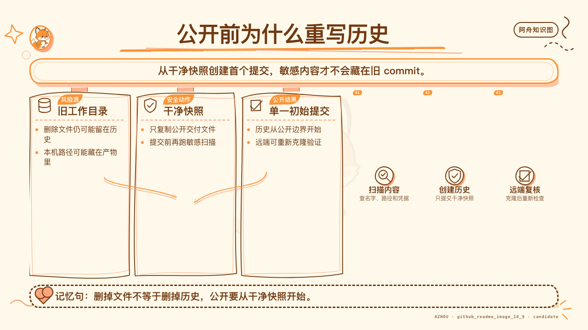

### 9.1 不要一次复制全部 37 个

先从团队真正反复遇到的失败开始。一个适合 UI 客户端团队的最小集合通常是：

- `ask-matt`；
- `grill-with-docs`；
- `to-spec`；
- `to-tickets`；
- `implement`；
- `tdd`；
- `diagnosing-bugs`；
- `domain-modeling`；
- `codebase-design`；
- `code-review`；
- `writing-for-agents`；
- `handoff`。

等到出现真实场景，再引入 `wayfinder`、`wizard`、`teach` 或 misc Skills。

### 9.2 建议目录

不同 Agent 的安装位置不同，但原则相同：项目级 Skill 应该和仓库一起版本化，并通过根指导文件提供精确指针。

```text
project/
├── AGENTS.md or CLAUDE.md
├── CONTEXT.md
├── docs/
│   ├── adr/
│   └── agents/
└── .agents/
    └── skills/
        ├── diagnosing-bugs/
        │   └── SKILL.md
        ├── tdd/
        │   └── SKILL.md
        └── code-review/
            └── SKILL.md
```

不要依赖某一个工具的私有目录名作为核心方法。关键是 Agent 能发现 Skill、团队能审查变更、版本能和项目一起演进。

### 9.3 本地化不是改名字

把上游 Skill 复制进项目后，至少检查：

| 检查项 | 要回答的问题 |
|---|---|
| 触发条件 | 是否会在小问题上误启动重流程 |
| 工具能力 | 当前 Agent 是否真的支持子 Agent、浏览器、tracker 和 shell |
| 文件路径 | tracker、ADR、领域文档放在哪里 |
| 安全边界 | 哪些命令、凭据和生产动作不能自动执行 |
| 完成条件 | 项目真正的测试、类型检查、构建和发布门禁是什么 |
| 术语 | Skill 是否使用项目的 `CONTEXT.md` 词汇 |

### 9.4 根指导文件只做路由

不要把 12 个 Skill 的全文塞进 `AGENTS.md`。更好的写法是：

```markdown
Bug fixes use the project diagnosing-bugs Skill when the symptom is hard to reproduce
or spans multiple layers. Read `.agents/skills/diagnosing-bugs/SKILL.md` completely
before forming a root-cause theory.
```

这一行同时说明了触发条件、目标文件和必须完整读取的动作，是一个锋利的 context pointer。

### 9.5 工具不支持时，流程要降级

Skill 里写了并行子 Agent，不代表当前运行时一定有该能力；写了 tracker API，也不代表账号已经授权。降级时要保留方法的核心：

- 没有子 Agent：顺序执行 Standards 与 Spec review，并保持结论分开；
- 没有 tracker：使用本地 Markdown tickets；
- 没有浏览器：保留视觉验证为 hold，不伪造通过；
- 没有生产权限：输出可审阅向导或阻塞，不冒充已完成。

### 9.6 迁移清单

- [ ] 固定并记录上游 commit。
- [ ] 选择最小 Skill 集合。
- [ ] 运行仓库 setup。
- [ ] 建立 `CONTEXT.md` 与 ADR 位置。
- [ ] 把项目真实命令写进完成条件。
- [ ] 检查 Agent 运行时能力与降级路径。
- [ ] 用一个小任务跑通。
- [ ] 用一个真实 bug 验证 red-capable 反馈环。
- [ ] review Skill 本身的触发、权限和隐私边界。
- [ ] 记录上游更新策略，避免静默漂移。

---

## 第 10 章 · 新人四周训练路线

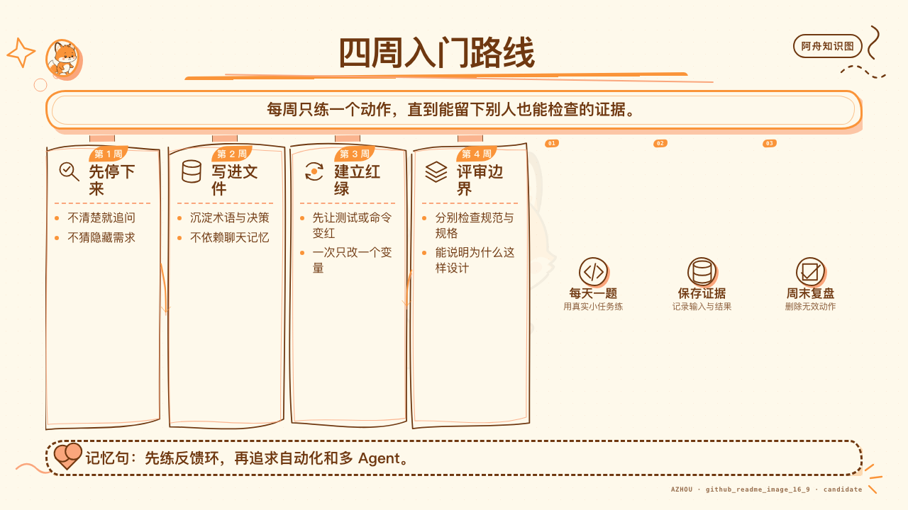

这四周不是按自然周强制打卡，而是四个能力台阶。新人可以每周只做一个小任务；已经稳定使用 Agent 的开发者可以直接用每周验收做跳级测试。验收还做不到，就从该周开始，不需要回到第一页重读。

### 第 1 周：学会停下来

目标：不再把所有任务都翻译成「立刻写代码」。

练习：

1. 用 `grill-me` 澄清一个不依赖代码的想法；
2. 用 `ask-matt` 为三个不同规模任务选流程；
3. 每次 Agent 解释没落地时使用 `wait-what`；
4. 为一个项目建立 10 个以内的 `CONTEXT.md` 术语。

验收：能区分事实问题、产品决定和需要外部专家回答的问题。

### 第 2 周：学会留下跨会话证据

目标：从一次性对话进入可交接工程。

练习：

1. 完成一次 `grill-with-docs`；
2. 把已定内容转成 `to-spec`；
3. 把规格拆成 3–5 张 tracer-bullet tickets；
4. 用 `handoff` 把一项未完成工作交给新会话。

验收：新会话不需要重问已经决定的范围，也不会依赖整段聊天记录。

### 第 3 周：学会用反馈限制 Agent

目标：让正确性来自可运行信号，不来自 Agent 自信。

练习：

1. 用 `tdd` 完成一个小行为；
2. 确认测试位于公共 seam；
3. 对一个真实 bug 建立 red-capable 命令；
4. 把最小复现固化成回归测试。

验收：能展示同一条命令先红后绿，并解释它为什么捕获的是目标症状。

### 第 4 周：学会评审设计和意图

目标：不只问「能不能跑」，还问「是不是对的事、是不是可持续的设计」。

练习：

1. 用 `code-review` 分开 Standards 与 Spec；
2. 对一个高频修改区域做 architecture candidate survey；
3. 用删除测试判断模块是否有深度；
4. 处理一个小型 merge conflict，并记录两侧意图。

验收：review finding 能指向行为、证据和最小修复，不使用模糊审美语言。

### 毕业标准

一个新人不需要背完 37 个 Skill。能做到下面五件事，就已经跨过最关键的门槛：

1. 模糊时先澄清，明确时不重复讨论；
2. 大任务留下 spec、tickets 和 handoff；
3. bug 先建反馈环，再谈理论；
4. 测试放在公共 seam，不锁死内部实现；
5. 完成声明只引用当前验证，不引用历史印象。

### 中级进阶：从一次任务到稳定交付链

如果你已经达到上面五条，不需要再背 Skill 名。连续完成下面四个挑战：

1. 选一个中等功能，从一次 `grill-with-docs` 一直走到 `code-review`，要求每个产物都能独立给新会话使用。
2. 选一个历史 bug，重建 red-capable 命令，记录为什么原来的测试没有捕获它。
3. 故意在上下文不完整时做一次 handoff，让新会话先找出遗漏，再修正 handoff 模板。
4. 对一份技术文档建立断言账本，至少修正一条「读起来正确、代码却已漂移」的说法。

中级验收：任意抽掉一段原始聊天，后续工作仍可以从 spec、ticket、测试和 handoff 恢复。

### 高阶进阶：从会使用 Skill 到会设计 Harness

高阶练习不再以「任务完成」为终点，而是检查工作流在换人、换 Agent、换工具和局部失败时是否仍然成立：

1. 为团队画一张「任务状态 → 失败风险 → Skill → 产物 → 验证」映射。
2. 为每个大型编排 Skill 定义显式调用权，避免 Agent 在小任务上自动开启大流程。
3. 为每个工具依赖写降级路径，同时标注不允许降级的安全、语义和验证门槛。
4. 用三次真实运行复盘 Skill 的路由错误、信息访问缺口和无效指令，不用一次成功会话修改全局规则。
5. 对完成声明建立证据等级：本地通过、集成通过、外部发布和人工批准不得互相替代。

高阶验收：抽掉一个子 Agent、一个 tracker API 或一个特定终端工具后，流程仍然能以较慢但可验证的方式完成；若不能，其依赖必须被明确写进 Skill 合同。

---

## 第 11 章 · 37 个 Skills 逐项小白手册

这一章不是把 frontmatter 翻译成中文，而是把每个 Skill 还原成一个新手可以执行的工作单元。建议第一次阅读时只看“什么时候用”和“什么时候别用”；遇到真实任务时，再回来照着“输入、步骤、产物、验收”运行。

> **固定版本说明：** 本章只对固定提交
> `6654f6b60cd9d5be8b54c6fafe44346dabeb3b76` 负责。调用语法会随 Agent
> 客户端变化，但触发条件、步骤顺序和证据要求仍然可以迁移。

### 11.1 Engineering：从想法到交付的 18 个 Skill

#### 11.1.1 `ask-matt`：不知道走哪条路时先路由

[固定版本原文](https://github.com/mattpocock/skills/blob/6654f6b60cd9d5be8b54c6fafe44346dabeb3b76/skills/engineering/ask-matt/SKILL.md)

**一句话理解：** 它不替你做任务，而是判断当前最接近哪种失败风险，并给出 Skill 链路。

**什么时候用：** 你知道要解决什么，但不知道应该先澄清、原型、写规格、拆票、诊断还是直接实现。

**什么时候别用：** 当前动作已经明确，例如“这个测试已经稳定复现，请按 `diagnosing-bugs` 继续”。这时再次路由只会增加一层转述。

**它会怎样判断：**

1. 想法是否仍有未决问题；
2. 问题能否在对话里回答，还是必须用原型或研究回答；
3. 工作是否超过一个会话；
4. 当前是在做功能、处理缺陷、维护代码库，还是跨越会话边界；
5. 下一阶段需要继续、清空上下文、交接、压缩，还是交给子 Agent。

**匿名 UI 客户端例子：** 团队准备增加“启动时恢复上次工作区”，但不清楚恢复失败时的交互，也不清楚状态应该由哪一层持有。合理路由是先 `grill-with-docs`，状态模型仍说不清时转 `prototype`，决定稳定后再 `to-spec`。

**可直接使用的输入：**

```text
/ask-matt

我要给桌面客户端增加“启动时恢复上次工作区”。
交互和状态归属还有未决问题，预计会改动界面、持久化和测试。
请判断应该先用哪些 Skill，并说明每次切换的条件。
```

**产物与验收：** 至少得到“当前阶段、推荐 Skill、为什么、何时切到下一 Skill、哪些 Skill 暂时不要用”。如果回答只是列出 37 个名字，路由没有完成。

**新手误区：** 把它当总控 Agent，一旦调用就让它包办所有阶段。它的职责是给路线，不是无限接管。

#### 11.1.2 `setup-matt-pocock-skills`：第一次使用前对齐仓库现实

[固定版本原文](https://github.com/mattpocock/skills/blob/6654f6b60cd9d5be8b54c6fafe44346dabeb3b76/skills/engineering/setup-matt-pocock-skills/SKILL.md)

**一句话理解：** 这是工程 Skills 的一次性仓库配置，把 tracker、triage 词汇和领域文档位置写清楚。

**什么时候用：** 刚把 Skills 引入一个仓库，准备第一次运行 `triage`、`to-spec`、`to-tickets` 或领域建模流程。

**什么时候别用：** 每个任务开始都跑一次；或者在不了解现有约定时直接覆盖已有 tracker 和文档布局。

**输入：**

- 仓库现有 issue/PR 管理方式；
- 已有标签或状态；
- 根指导文件；
- `CONTEXT.md`、ADR、docs 的当前位置；
- 团队愿意接受的最小改动。

**执行顺序：**

1. 先探索现状，不创建文件；
2. 报告发现、冲突和可选方案；
3. 由用户确认 tracker、标签词汇和领域文档布局；
4. 只写经过确认的配置与指针；
5. 回读文件，确认下游 Skill 能找到它们。

**匿名 UI 客户端例子：** 仓库已经使用本地 Markdown issue，而不是 GitHub Issues。setup 不应该强行迁移平台，只需把本地 issue 根目录、阻塞关系写法和领域文档路径配置给后续 Skills。

**产物与验收：** 下游 Skill 能回答三件事：规格发布到哪里、ticket 状态怎样表达、领域术语和 ADR 去哪里读写。缺一项都不算 setup 完成。

**新手误区：** 把 setup 当脚手架生成器。它真正生成的是共同约定；文件只是约定的载体。

#### 11.1.3 `grill-with-docs`：在真实仓库里把问题问清楚

[固定版本原文](https://github.com/mattpocock/skills/blob/6654f6b60cd9d5be8b54c6fafe44346dabeb3b76/skills/engineering/grill-with-docs/SKILL.md)

**一句话理解：** 它把 `grilling` 的决策树与 `domain-modeling` 的共同语言结合起来，边讨论边留下仓库证据。

**什么时候用：** 模糊问题发生在一个真实工作目录里，而且决定会影响模块、术语、边界或长期维护。

**什么时候别用：** 没有仓库的个人想法，用 `grill-me`；决定已经完成，只需整理，用 `to-spec`。

**Agent 必须自己查的事实：** 现有组件、状态管理方式、测试框架、类似交互、编码规范、领域文档。不要把这些问题甩回给用户。

**必须交给人决定的事项：** 用户体验取舍、容错政策、范围、非目标、兼容策略、风险偏好。

**匿名 UI 客户端例子：** “关闭窗口”究竟是退出应用、隐藏到托盘，还是保留后台任务？Agent 先查当前窗口生命周期，再向用户询问产品决策；确定词义后，立即把“关闭”“退出”“隐藏”写入领域词汇。

**可直接使用的输入：**

```text
/grill-with-docs

请把“关闭窗口后的行为”问清楚。
你负责先检查仓库现状；需要产品取舍时再问我。
每个稳定术语立即更新领域文档，只有难以逆转的决定才建议 ADR。
```

**产物与验收：** 决策树 frontier 为空；事实有代码或文档证据；术语在讨论形成时已经落盘；仍有未决问题时不能假装进入实现。

**新手误区：** 会后一次性写总结。这样最容易漏掉决定改变过程中的词义修正。

#### 11.1.4 `triage`：先确认来件是什么，再决定谁处理

[固定版本原文](https://github.com/mattpocock/skills/blob/6654f6b60cd9d5be8b54c6fafe44346dabeb3b76/skills/engineering/triage/SKILL.md)

**一句话理解：** 它把外部 issue 和 PR 推进一套状态机，不让未经核验的描述直接变成实现任务。

**适合处理：** 未分类 issue、`needs-triage`、补充信息后重新活跃的 `needs-info`，以及明确点名的外部 PR。

**不适合处理：** `to-tickets` 刚生成的实现票。那些票已经是 agent-ready，再 triage 一次属于重复流程。

**核心步骤：**

1. 读完整 body、评论、标签、作者和时间；PR 还要读 diff；
2. 用领域概念搜索是否已经实现，并检查过去是否明确拒绝；
3. 给出分类和状态建议，等待维护者方向；
4. 对 bug 真实复现，对 PR 运行相关验证；
5. 信息不足才进入 grilling；
6. 写 agent brief、needs-info notes，或按理由关闭。

**匿名 UI 客户端例子：** 用户报告“设置偶尔丢失”。triage 先检查是否已存在自动恢复逻辑和类似 issue，再按报告步骤复现。没有操作系统、版本和最小步骤时进入 `needs-info`，而不是猜根因并开工。

**产物与验收：** 每项都有当前状态、核验结果、代码位置或缺失信息、下一责任人。一个“看起来像 bug”的标签不是核验。

**新手误区：** 只改标签不留可执行 brief；或者把“无法复现”误写成“问题不存在”。

#### 11.1.5 `wayfinder`：大工程先画决策地图，不急着施工

[固定版本原文](https://github.com/mattpocock/skills/blob/6654f6b60cd9d5be8b54c6fafe44346dabeb3b76/skills/engineering/wayfinder/SKILL.md)

**一句话理解：** 当目标远到一个会话看不清路线时，用 decision tickets 逐步驱散 fog of war。

**什么时候用：** 绿地项目、跨多子系统的大功能、关键决定相互依赖、单次 grilling 放不下。

**什么时候别用：** 一个边界清楚、两三天能完成的功能。wayfinder 的认知成本很高。

**地图里装什么：**

- Destination：走到什么状态算看清路线；
- Decisions so far：已经稳定的决定；
- Not yet specified：尚未解决的区域；
- Out of scope：这张地图不处理什么；
- Decision tickets：每张只解决一个决定，并声明依赖。

**ticket 类型：** 可以通过讨论解决的 grilling ticket；必须看到可运行结果的 prototype ticket；依赖一手资料的 research ticket；必须由人完成外部动作的 task ticket。

**匿名 UI 客户端例子：** “重做插件系统”同时涉及权限、安装、版本、沙箱、UI、迁移和回滚。先建地图；“插件权限模型”阻塞“安装确认 UI”，“版本兼容策略”阻塞“自动更新”。地图清晰后再 `to-spec`，不要直接 `implement`。

**产物与验收：** 所有重要未知都被命名；ticket 之间有真实依赖；地图最终产生决定而非半成品代码；进入实现前有一份收拢后的 spec。

**新手误区：** 把它当超大 todo list。它管理的是“还不知道什么”，不是“代码文件有哪些”。

#### 11.1.6 `to-spec`：把已经讨论清楚的内容固定下来

[固定版本原文](https://github.com/mattpocock/skills/blob/6654f6b60cd9d5be8b54c6fafe44346dabeb3b76/skills/engineering/to-spec/SKILL.md)

**一句话理解：** 它只做 synthesis，不做 interview；把当前对话中的已决内容变成一份可交付规格。

**输入前提：** Problem、Solution、用户故事、关键实现决定、测试 seam 和 Out of Scope 已经在对话中出现。

**什么时候别用：** 仍有关键问题没人回答。不要让 Agent 在写规格时偷偷发明答案。

**规格固定结构：**

1. Problem Statement；
2. Solution；
3. 编号 User Stories；
4. Implementation Decisions；
5. Testing Decisions；
6. Out of Scope；
7. Further Notes。

**匿名 UI 客户端例子：** “新增离线状态条”已经决定展示位置、状态来源、重试行为和无网络文案。to-spec 将这些决定写成用户故事，并明确不在本期加入离线编辑队列。

**可直接使用的输入：**

```text
/to-spec

把当前对话整理成规格。不要追加新决定。
重点保留离线状态的来源、展示规则、重试行为、测试 seam 和非目标。
```

**产物与验收：** 每个用户故事可观察；测试决定指向公共 seam；非目标明确；任何从未在对话中出现的新政策都必须删除或标为未决。

**新手误区：** 把“完整”理解成“什么都写”。规格的完整，是决定边界完整，不是篇幅大。

#### 11.1.7 `to-tickets`：把规格切成能独立反馈的纵向薄片

[固定版本原文](https://github.com/mattpocock/skills/blob/6654f6b60cd9d5be8b54c6fafe44346dabeb3b76/skills/engineering/to-tickets/SKILL.md)

**一句话理解：** 每张 ticket 都穿过必要层级，交付一条可观察行为，并显式声明 blocked-by 边。

**输入：** 一份规格、计划，或已经足够稳定的当前对话；可选地先探索代码以找到真正 seam。

**切票检查：**

- 用户完成这张票后能观察到什么变化；
- 是否包含它所需的界面、契约、逻辑和测试；
- 是否可以独立验收；
- 是否真的被另一张票阻塞；
- 标题能否表达行为，而不是技术层。

**匿名 UI 客户端例子：**

- 票 1：用户保存一个最小账号配置，重启后仍可见；
- 票 2：用户验证配置并看到成功/失败；
- 票 3：用户设为默认并完成一次真实调用；
- 票 4：用户删除配置，运行时安全回退。

**不好的切法：** “先写类型”“再写 IPC”“再写页面”“最后补测试”。关闭前三张票时用户仍得不到可用行为。

**产物与验收：** 每张票有 Parent、What to build、Acceptance criteria、Blocked by；依赖图没有循环；除宽范围机械迁移外，默认使用 tracer-bullet。

**新手误区：** 为了看起来并行，把真实依赖删掉；或者把所有票都标成阻塞，失去 frontier。

#### 11.1.8 `implement`：按批准的 spec 或 ticket 施工

[固定版本原文](https://github.com/mattpocock/skills/blob/6654f6b60cd9d5be8b54c6fafe44346dabeb3b76/skills/engineering/implement/SKILL.md)

**一句话理解：** 这是施工入口：按预先批准的工作说明实现，在约定 seam 做 TDD，持续验证，最后 review 并提交。

**前置输入：** spec 或 tickets、当前分支、预先同意的测试 seam、项目真实验证命令。

**执行顺序：**

1. 读清当前票和所有阻塞项；
2. 在约定 seam 尽可能使用 `tdd`；
3. 经常运行单测文件和 typecheck；
4. 只做当前票，不顺手扩范围；
5. 结束时运行完整测试套件；
6. 调用 `code-review`；
7. 修复 finding 后提交当前分支。

**匿名 UI 客户端例子：** 当前票只要求“验证账号配置并显示结果”。实现不应顺便加入账号排序、导入导出和自动重试；发现产品未决定错误文案时应上报，而不是自行设计。

**产物与验收：** diff 可追溯到票；目标测试与 typecheck 有当前输出；完整测试在结束时运行；review finding 已处理或明确记录；提交只包含当前工作。

**新手误区：** 把 `implement` 理解成“自由发挥直到看起来完整”。它恰恰要求施工阶段服从已定边界。

#### 11.1.9 `prototype`：用可丢弃代码回答一个设计问题

[固定版本原文](https://github.com/mattpocock/skills/blob/6654f6b60cd9d5be8b54c6fafe44346dabeb3b76/skills/engineering/prototype/SKILL.md)

**一句话理解：** 原型的交付物不是产品代码，而是一个被真实运行回答掉的问题。

**两条分支：**

- “逻辑或状态模型是否合理？”：做单文件 HTML，让非开发者通过按钮和引导场景推动状态机；
- “UI 应该长什么样？”：在同一路由提供多个结构明显不同的变体，可快速切换。

**共同约束：** 明确标注 prototype；一条命令或双击即可运行；默认只用内存状态；不补生产级抽象、测试和错误处理；每次动作都把相关状态暴露出来。

**匿名 UI 客户端例子：** 团队无法仅靠文字决定“任务详情”应该是抽屉、侧栏还是独立页。原型同时做三个差异足够大的变体，使用同一组真实长度的合成数据，让用户完成相同任务后再决定。

**产物与验收：** 问题写在原型顶部；每个变体能被运行；用户给出 verdict；被验证的决定进入正式 issue/spec；原型保存在 main 之外的 throwaway 分支并留下指针。

**新手误区：** 把原型做成“以后也许能直接上线”的半成品，于是开始补架构、权限和完整测试，反馈速度反而消失。

#### 11.1.10 `diagnosing-bugs`：先制造稳定红色，再形成理论

[固定版本原文](https://github.com/mattpocock/skills/blob/6654f6b60cd9d5be8b54c6fafe44346dabeb3b76/skills/engineering/diagnosing-bugs/SKILL.md)

**一句话理解：** 疑难 bug 的第一产物是一条能捕获精确症状的 red-capable 命令，而不是一篇根因猜测。

**完整循环：**

1. Redact：先移除日志、数据和命令中的敏感信息；
2. Feedback loop：找到当前会红的测试、脚本或自动化；
3. Reproduce：确认捕获的是用户症状；
4. Minimise：删掉无关步骤和变量；
5. Hypothesise：列 3–5 个可证伪假设；
6. Instrument：一次只插一个探针，区分假设；
7. Fix：最小修复并加入回归测试；
8. Cleanup：删除临时日志，重新跑当前验证。

**匿名 UI 客户端例子：** “切换工作区后偶尔显示旧标题”。先写自动化连续切换并断言标题与当前工作区一致；确认它在旧代码上稳定失败；再分别测试缓存未失效、事件乱序、状态覆盖等假设。

**可直接使用的输入：**

```text
请调用 diagnosing-bugs。
症状是连续切换工作区后标题偶尔仍显示上一个名称。
先建立能在当前分支稳定变红的最小命令；在看到红色前不要给根因结论。
```

**产物与验收：** 同一条命令在修复前红、修复后绿；回归测试位于公共 seam；临时埋点被移除；日志已脱敏。

**新手误区：** 先写“深度根因分析”，最后才发现症状根本不能稳定复现。

#### 11.1.11 `tdd`：一次只推动一个可观察行为

[固定版本原文](https://github.com/mattpocock/skills/blob/6654f6b60cd9d5be8b54c6fafe44346dabeb3b76/skills/engineering/tdd/SKILL.md)

**一句话理解：** 在预先同意的公共 seam 上，写一个因为目标行为缺失而失败的测试，只实现足够让它变绿的代码。

**好测试的三个问题：**

1. 它验证用户或调用方可观察的行为吗；
2. 重构内部实现时它仍应成立吗；
3. 失败时能说明哪条行为被破坏吗。

**seam 选择：** 优先最高层、最少数量、稳定的公共接口。外部 API、时钟、随机数可以 mock；不要 mock 自己的模块来模拟成功。

**匿名 UI 客户端例子：** 对“保存设置后重启仍保留”写一条穿过公共设置接口的测试，而不是分别测试序列化函数、文件函数和状态 reducer 的内部调用顺序。

**循环：**

1. 写一条测试；
2. 运行并看到预期红色；
3. 写最小实现；
4. 再运行看到绿色；
5. 进入下一条行为。

**产物与验收：** 每个测试都曾因目标行为缺失而失败；测试没有复刻实现算法；没有先批量写十个红测试；固定提交当前把重构交给 review 阶段，不能把其他 TDD 版本的口号强加进来。

**新手误区：** 先写完实现，再补一个必绿测试，然后把它称为 TDD。

#### 11.1.12 `research`：外部事实必须回到一手来源

[固定版本原文](https://github.com/mattpocock/skills/blob/6654f6b60cd9d5be8b54c6fafe44346dabeb3b76/skills/engineering/research/SKILL.md)

**一句话理解：** 把外部阅读交给后台 Agent，沿官方文档、规范、源码或第一方 API 追溯每项关键事实，并保存带引用的 Markdown。

**什么时候用：** 实现决定依赖浏览器行为、SDK 契约、协议、框架限制、版本差异或官方最佳实践。

**什么时候别用：** 答案就在当前仓库；或者只是想收集更多二手观点，却没有待解决的具体决定。

**匿名 UI 客户端例子：** 要决定系统通知在不同桌面平台的权限与点击行为。research 应查看各平台官方文档和所用运行时的官方 API，不以博客摘要代替。

**输入要写清：** 待回答的问题、固定版本、需要支持的环境、输出路径、哪些决定会被研究结果改变。

**产物与验收：** 单个 Markdown 文件；每个关键结论附近有一手来源；事实与推断分开；版本和日期可追溯；文件进入后续 `grill-with-docs`，不直接冒充产品决定。

**新手误区：** 搜到“大家都这么做”就停止追溯；或者只把链接堆在末尾，读者无法知道哪条链接支持哪项结论。

#### 11.1.13 `domain-modeling`：先统一词义，再让代码承载词义

[固定版本原文](https://github.com/mattpocock/skills/blob/6654f6b60cd9d5be8b54c6fafe44346dabeb3b76/skills/engineering/domain-modeling/SKILL.md)

**一句话理解：** 用具体场景把模糊、重载或冲突的领域词压实，并立即更新 `CONTEXT.md`。

**重点动作：**

- 用现有 glossary 挑战新说法；
- 把“状态正常”“保存成功”这类模糊词变成可观察场景；
- 区分同一个词承担的多个概念；
- 把术语和真实代码位置交叉引用；
- 决定形成时 inline 更新；
- 只有难以逆转且不记录会令人意外时才建议 ADR。

**匿名 UI 客户端例子：** “连接”可能指保存凭据、验证凭据、建立长连接或启用账号。把它们统一叫连接会让 UI 文案和函数名不断漂移。领域建模应给每个行为一个能用例子反证的名字。

**产物与验收：** glossary 词条有定义、正例、反例和代码指针；后续 spec、ticket、测试和界面文案使用同一词义；ADR 数量保持克制。

**新手误区：** 把 `CONTEXT.md` 写成百科全书。它首先是共同语言和导航，不是整个系统的复制品。

#### 11.1.14 `codebase-design`：用深模块语言讨论代码形状

[固定版本原文](https://github.com/mattpocock/skills/blob/6654f6b60cd9d5be8b54c6fafe44346dabeb3b76/skills/engineering/codebase-design/SKILL.md)

**一句话理解：** 它提供一组精确词汇，帮助团队判断复杂度是否被藏在小接口后面。

**核心词：**

| 词 | 小白解释 |
|---|---|
| Module | 一组共同承担某种能力的实现 |
| Interface | 调用方必须理解的表面 |
| Depth | 实现能力相对接口复杂度的比值 |
| Seam | 可以从外部验证或替换行为的位置 |
| Adapter | 把一种外部形状翻译为模块形状 |
| Leverage | 一处改动能服务多少调用方 |
| Locality | 理解一个行为需要跳多少位置 |

**删除测试：** 假设删除这个模块。调用方需要重新实现多少复杂逻辑？如果只是把几行转发挪走，它很浅；如果大量规则重新散到各处，它可能很深。

**匿名 UI 客户端例子：** 五个设置组件依次调用 `read`、`parse`、`merge`、`validate`、`write`。更深的模块可以只暴露 `loadSettings` 与 `saveSettings`，把顺序、默认值和迁移藏起来。

**产物与验收：** 设计讨论能说明接口、被隐藏的复杂度、seam、测试面和调用方收益；不会只说“再抽一层”或“更优雅”。

**新手误区：** 把文件短、函数多、类多误认为模块化。模块深度看的是调用方少学了多少，不是文件数量。

#### 11.1.15 `improve-codebase-architecture`：先找高价值候选，再讨论接口

[固定版本原文](https://github.com/mattpocock/skills/blob/6654f6b60cd9d5be8b54c6fafe44346dabeb3b76/skills/engineering/improve-codebase-architecture/SKILL.md)

**一句话理解：** 它先调查最近常改、理解成本高的区域，生成视觉 HTML 候选报告；用户选中后才进入 grilling。

**执行顺序：**

1. 如果用户没给范围，先从一段 git 历史找热点；
2. 读取 `CONTEXT.md` 和相关 ADR；
3. 用 `codebase-design` 词汇调查浅模块、低 locality 和不真实 seam；
4. 对候选做删除测试；
5. 在系统临时目录生成带 before/after 的 HTML 报告；
6. 用户选择一个候选；
7. 再通过 grilling 讨论接口和迁移。

**匿名 UI 客户端例子：** 最近十次改动都触碰窗口偏好、托盘行为和启动设置。报告发现调用方必须知道同一套默认值和迁移顺序，推荐把这些规则放进一个深模块，但在用户选择前不直接重构。

**产物与验收：** 候选有文件、问题、方案、收益、推荐强度和图；顶级建议有依据；报告不落入仓库；未被选择的候选不产生代码改动。

**新手误区：** 跑一次架构扫描就自动重构全仓；或者脱离近期变化，列一堆理论上可优化但没人会再碰的区域。

#### 11.1.16 `code-review`：把 Standards 与 Spec 分开验收

[固定版本原文](https://github.com/mattpocock/skills/blob/6654f6b60cd9d5be8b54c6fafe44346dabeb3b76/skills/engineering/code-review/SKILL.md)

**一句话理解：** 钉住一个 fixed point，再分别回答“代码是否符合仓库规范”和“代码是否完成原始需求”。

**前置证据：**

- fixed point：commit、branch、tag 或 merge-base；
- spec source：issue、规格或验收清单；
- standards source：仓库指导文件、编码标准和相关文档；
- 当前 diff 与验证输出。

**两个隔离问题：**

- Standards 轴：设计、可读性、安全、测试、仓库规则是否满足；
- Spec 轴：用户故事、非目标、边界案例、验收是否满足。

**匿名 UI 客户端例子：** 新的错误提示组件结构清晰、测试完整，但漏掉“离线时不显示重试按钮”的需求。Standards 可通过，Spec 仍失败；总评不能用代码质量把需求缺口平均掉。

**产物与验收：** 两条轴分别列 finding、证据、严重度和最小修复；聚合时保留来源；只有两轴都通过才能收口。

**新手误区：** 只做 lint 风格检查；或者只照需求点功能，忽略测试泄漏内部实现和越界依赖。

#### 11.1.17 `resolving-merge-conflicts`：解决两侧意图，不是选一侧文本

[固定版本原文](https://github.com/mattpocock/skills/blob/6654f6b60cd9d5be8b54c6fafe44346dabeb3b76/skills/engineering/resolving-merge-conflicts/SKILL.md)

**一句话理解：** 对每个冲突 hunk 追溯两侧提交、issue 和 PR 的原始意图，尽可能同时保留，再完成 merge/rebase。

**执行顺序：**

1. 查看当前 merge/rebase 状态和历史；
2. 找到每侧改动的 primary source；
3. 逐 hunk 解释两侧意图；
4. 能兼容就合并，不能兼容就按本次合并目标选择并记录取舍；
5. 不发明新行为；
6. 运行项目检查；
7. stage 并继续操作直到结束。

**匿名 UI 客户端例子：** 一侧给设置项增加禁用态，另一侧把同一区域改成异步加载。正确结果应同时保留加载态和禁用规则，而不是接受“ours”或“theirs”。

**产物与验收：** 工作树没有未解决冲突；项目验证通过；merge/rebase 完成；每个不兼容取舍能解释来源。上游 Skill 明确要求总是解决，不执行 `--abort`。

**新手误区：** 看到冲突标记就按“较新的代码”选择。时间不能说明产品和架构意图。

#### 11.1.18 `wizard`：把只有人能做的步骤变成可审阅向导

[固定版本原文](https://github.com/mattpocock/skills/blob/6654f6b60cd9d5be8b54c6fafe44346dabeb3b76/skills/engineering/wizard/SKILL.md)

**一句话理解：** 当 Agent 确实无法代替人点击控制台、处理密钥或确认不可逆动作时，生成一份阶段化 Bash 向导。

**什么时候用：** 创建第三方凭据、配置 CI secret、陌生控制台操作、一次性迁移或 cutover。

**什么时候别用：** Agent 可以通过已有工具安全完成的普通命令。不要把自动化能力退化成“请人手工做”。

**制作步骤：**

1. 读仓库，列出全部人工阶段和每个阶段产生的值；
2. 确认值从哪里取得、写到哪里、是否为 secret；
3. 为每阶段写精确点击路径和 URL，不知道就查官方文档，不能编；
4. 复制稳定模板，只编写 stages；
5. secret 使用隐藏输入，写入时幂等；
6. 不可逆动作前显式确认；
7. 用 `bash -n`，可用时再跑 shellcheck；不要由 Agent 代替用户完整执行。

**匿名 UI 客户端例子：** 管理员需要在第三方控制台创建最小权限 token，再写入本地环境和 CI。向导打开正确页面、提示权限、隐藏读取 token、写入目标并运行脱敏连通性检查。

**产物与验收：** 所有人工步骤都有顺序和剩余阶段；每个值有来源与落点；secret 不进入聊天、日志或命令历史；脚本语法通过；是否提交仓库由可重复性决定。

**新手误区：** 把真实 secret 粘贴进对话，或者让 Agent 猜控制台按钮名称。

### 11.2 Productivity：思考、交接、教学与 Agent 文档的 7 个 Skill

#### 11.2.1 `grill-me`：没有仓库时，把脑中的想法问清楚

[固定版本原文](https://github.com/mattpocock/skills/blob/6654f6b60cd9d5be8b54c6fafe44346dabeb3b76/skills/productivity/grill-me/SKILL.md)

**一句话理解：** 这是 `grilling` 的无仓库入口，适合计划、设计和想法澄清。

**什么时候用：** 答案主要在用户脑中，且当前没有需要同步维护的工作目录。

**什么时候别用：** 事实在代码或文档里；发生在真实仓库中时应优先 `grill-with-docs`；决定已经结束时应使用 `to-spec`。

**它实际做什么：** `grill-me` 本身非常薄，只负责调用 `grilling`。这正是 router Skill 的示范：入口稳定，提问纪律只有一个来源，避免两套访谈规则漂移。

**匿名 UI 客户端例子：** 产品负责人还没有仓库，只想先决定“首次启动引导”要解决什么问题。Agent 逐轮确认目标用户、必须完成的动作、可跳过策略、失败处理和明确非目标。

**可直接使用的输入：**

```text
/grill-me

请把桌面客户端的首次启动引导问清楚。
我希望最后得到可以转成规格的决定，不要先画页面，也不要替我决定产品取舍。
```

**产物与验收：** frontier 为空；所有事实由 Agent 调查或明确标为不可得；所有产品决定由用户确认；会话末尾能清楚区分已决、未决和非目标。

**新手误区：** 把“relentless”理解成无限追问。问题应该沿依赖树推进，前置未定时不能问下游细节。

#### 11.2.2 `grilling`：用决策树和 frontier 管理追问

[固定版本原文](https://github.com/mattpocock/skills/blob/6654f6b60cd9d5be8b54c6fafe44346dabeb3b76/skills/productivity/grilling/SKILL.md)

**一句话理解：** 把一个设计建模成决策树，每一轮只问前置条件已经稳定的 frontier，并给每题一个推荐答案。

**三个关键概念：**

- Decision tree：一个决定会解锁哪些后续决定；
- Prerequisite：回答当前问题前必须先稳定的上游决定；
- Frontier：此刻无需猜测就能回答的全部问题。

**一轮的正确形状：** 同时询问当前 frontier 上的所有独立问题；每题编号，说明为什么要问，并给出推荐答案；然后等待用户回答，重新计算下一轮。

**事实与决定的边界：** “当前框架支持什么”由 Agent 查；“团队愿意承担哪种兼容成本”由用户定。一个好的 grilling 会减少用户负担，而不是把代码库调查伪装成访谈。

**匿名 UI 客户端例子：** 在决定错误详情如何展示前，必须先知道目标用户是谁、错误是否可恢复；“复制诊断信息按钮放哪”不是第一轮问题。

**产物与验收：** 没有问题依赖同轮尚未回答的问题；每轮结束后设计树被更新；frontier 为空才声明共同理解；在用户确认之前不进入实施。

**新手误区：** 一次列 30 个问题，表面全面，实际把前置与下游混在一起，用户只能凭空猜。

#### 11.2.3 `handoff`：让工作跨会话旅行，但不复制整个世界

[固定版本原文](https://github.com/mattpocock/skills/blob/6654f6b60cd9d5be8b54c6fafe44346dabeb3b76/skills/productivity/handoff/SKILL.md)

**一句话理解：** 把当前会话压缩成一份放在系统临时目录的交接文档，让新 Agent 从权威产物继续。

**什么时候用：** 新工具、新目录、新同事、侧任务，或当前上下文必须跨越 harness。

**什么时候别用：** 仍在同一阶段且上下文健康；只需要开一个短子任务；spec、ticket 和 commit 已足够描述后续工作时不应重复抄写。

**必须包含：**

- 目标与当前状态；
- 已完成和未完成；
- 权威文件、issue、commit、diff 的指针；
- 当前验证结果及时间边界；
- 风险、阻塞和下一步；
- suggested skills；
- 敏感信息脱敏说明。

**匿名 UI 客户端例子：** 原会话完成了错误状态规格，新会话只负责制作 UI prototype。handoff 指向 spec 和原型目标，不重贴全部访谈；明确“不要写生产代码”和验收问题。

**产物与验收：** 文档位于 OS 临时目录，不污染仓库；新 Agent 无需重问已决定内容；没有密钥、个人路径和原始敏感日志；旧的测试结果被标为历史快照。

**新手误区：** 把聊天摘要当事实源。真正稳定的事实应在 spec、ticket、代码和测试里，handoff 只做索引与状态压缩。

#### 11.2.4 `teach`：把一次问答变成跨会话学习工作区

[固定版本原文](https://github.com/mattpocock/skills/blob/6654f6b60cd9d5be8b54c6fafe44346dabeb3b76/skills/productivity/teach/SKILL.md)

**一句话理解：** 围绕学习使命建立持久目录，用短课、参考材料、学习记录和反馈练习提升长期掌握。

**工作区组成：**

- `MISSION.md`：为什么要学，所有课程的判断基准；
- `RESOURCES.md`：高可信知识来源；
- `lessons/*.html`：一次只教一个小目标；
- `reference/*.html`：可反复查阅的压缩知识；
- `learning-records/*.md`：非显然的学习进展和修正；
- `assets/*`：课程复用组件；
- `NOTES.md`：教学偏好和工作笔记。

**学习原则：** 知识获取阶段降低无关难度；技能训练阶段通过检索练习、间隔和交错增加“有益难度”；不要把当下答得快误认为长期记得住。

**匿名 UI 客户端例子：** 新人要学会诊断跨层 bug。第一课只练“构造 red-capable 命令”，第二课再练最小化，第三课混入事件乱序案例；每课都能在十几分钟内完成并得到即时反馈。

**产物与验收：** 每课与 mission 直接相关；有一手资料；练习难度落在当前最近发展区；课程短而可完成；长期进展写进 learning record，而不是依赖聊天记忆。

**新手误区：** 一次生成一门宏大课程，内容很多但没有练习反馈，也没有后续会话可读取的学习状态。

#### 11.2.5 `to-questionnaire`：把别人脑中的信息异步取回来

[固定版本原文](https://github.com/mattpocock/skills/blob/6654f6b60cd9d5be8b54c6fafe44346dabeb3b76/skills/productivity/to-questionnaire/SKILL.md)

**一句话理解：** 当用户无法回答主题本身时，只采访“发给谁、需要拿回什么”，再为真正知情者写问卷。

**什么时候用：** 关键事实掌握在安全、运维、设计、法务、支持或外部供应商等另一位专家手里。

**核心原则：** Grill the send, not the subject。用户总能回答收件人是谁、需要什么决定；不强迫用户替专家猜答案。

**文档结构：**

1. 标题、Purpose、From/To、答案用途；
2. 足够回答的 Context；
3. How to answer：期限、预计耗时、允许“不知道”；
4. 按重要性排序的主题问题；
5. 每个问题只问一个概念，必要时写 why this matters；
6. Anything else。

**匿名 UI 客户端例子：** 团队要设计企业代理设置，但网络管理员才知道认证、证书和例外域名。问卷应询问这些事实会影响哪些决定，而不是问“您觉得页面怎么设计”。

**产物与验收：** `to-questionnaire-<slug>.md` 存在；用户列出的每个信息缺口都有问题；最重要问题在前；收件人无需了解原对话也能回答。

**新手误区：** 写成满意度调查或把多个问题塞进一句；异步场景可能只有一次回复机会。

#### 11.2.6 `wait-what`：上一条没听懂，先退回共同前提

[固定版本原文](https://github.com/mattpocock/skills/blob/6654f6b60cd9d5be8b54c6fafe44346dabeb3b76/skills/productivity/wait-what/SKILL.md)

**一句话理解：** 它要求 Agent 为上一条回复补少量背景，用 ASD-STE100 风格的简明英语和项目共同语言重新表达。

**什么时候用：** 回复跳步、术语密集、缺失前提，用户知道“没听懂”但不确定从哪里断线。

**什么时候别用：** 需要修改事实或方案；这不是“说得更简单就算修复”的替代品。

**匿名 UI 客户端例子：** Agent 突然说“把该 adapter 设为 seam 可以提高 locality”。调用后，它应先解释调用方目前被迫知道哪些内部步骤，再用 `CONTEXT.md` 已有词汇重讲 adapter、seam 与 locality。

**可直接使用的输入：**

```text
/wait-what
```

**产物与验收：** 新解释补回缺失上下文；句子短；术语与领域文档一致；不是简单同义改写原句。

**新手误区：** 因为没听懂就让 Agent 从头重写整份文档。先修复刚刚断掉的那一步，成本更低。

#### 11.2.7 `writing-for-agents`：写给 Agent 的文档要改变行为

[固定版本原文](https://github.com/mattpocock/skills/blob/6654f6b60cd9d5be8b54c6fafe44346dabeb3b76/skills/productivity/writing-for-agents/SKILL.md)

**一句话理解：** 用 context pointer、信息层级、明确步骤和完成条件，让 Agent 每次运行采取同一过程，而不是生成同一句输出。

**两个负担：**

- Context load：总在上下文里的文字成本，例如根指导文件；
- Cognitive load：人需要记住有哪些文档、何时调用的成本。

**context pointer 的两个任务：** 说明目标材料是什么；写清哪些不同分支会触发读取。一个重要文档藏在模糊指针后面，是可重复性缺陷。

**信息层级：**

1. 当前文件中的执行步骤；
2. 当前文件中的按需参考；
3. 由精准指针指向的外部参考。

**匿名 UI 客户端例子：** 根指导文件不应粘贴整套跨进程安全规范，只需写：“修改 renderer 与主进程数据通道时，先读取 `docs/security-boundaries.md` 并运行边界测试。”这条指针同时有触发和动作。

**写 Skill 时的验收：** description 能触发正确分支；步骤顺序可执行；边界与完成条件可观察；引用文件有达到条件；删除无行为影响的 no-op 句子。

**新手误区：** 通过加粗“必须”“绝对”来提高权威感。若一句话没有改变 Agent 下一步，语气再强也只是上下文噪音。

### 11.3 Misc：四个强场景、强工具约束的 Skill

Misc 不是“低价值”，而是“适用面窄”。使用前先确认仓库、运行时和团队政策真的匹配，不要把作者自己的工具链习惯误当通用工程原则。

#### 11.3.1 `git-guardrails-claude-code`：在 Claude Code 执行前拦截危险 Git 命令

[固定版本原文](https://github.com/mattpocock/skills/blob/6654f6b60cd9d5be8b54c6fafe44346dabeb3b76/skills/misc/git-guardrails-claude-code/SKILL.md)

**一句话理解：** 安装 Claude Code `PreToolUse` hook，在 Bash 命令真正执行前阻止 push、hard reset、强制 clean 等动作。

**默认拦截：** `git push`、`git reset --hard`、`git clean -f/-fd`、`git branch -D`、`git checkout .`、`git restore .`。

**什么时候用：** 团队允许 Agent 读写本地仓库，但所有远程推送和破坏性 Git 动作必须由人单独授权。

**什么时候别用：** 当前不是 Claude Code；已有组织级命令策略；或者直接复制配置会覆盖现有 hooks。

**执行顺序：**

1. 选择项目级还是全局；
2. 复制 hook 脚本并赋执行权限；
3. 把 hook 合并进现有 settings，不覆盖其他数组项；
4. 询问团队是否调整阻止模式；
5. 用模拟 `git push origin main` 的 JSON 输入验证 exit code 2 和 BLOCKED 信息。

**匿名 UI 客户端例子：** 新人练习 Agent 协作时可以允许本地提交，但避免未经复核就推送远程。项目级 hook 随仓库共享，全球设置则影响所有项目，二者不能悄悄替用户选择。

**产物与验收：** hook 文件存在且可执行；settings 合并正确；危险样例被拒绝；普通只读 Git 命令不受影响。

**新手误区：** 认为写进规则文件就能阻止命令。真正的 guardrail 必须位于运行时执行边界，并用可观察失败验证。

#### 11.3.2 `migrate-to-shoehorn`：只在测试里减少大型对象伪造

[固定版本原文](https://github.com/mattpocock/skills/blob/6654f6b60cd9d5be8b54c6fafe44346dabeb3b76/skills/misc/migrate-to-shoehorn/SKILL.md)

**一句话理解：** 在 TypeScript 测试中，用 `@total-typescript/shoehorn` 的 helper 替换脆弱的 `as Type` 和双重断言。

**适合：** 测试只关心大型对象的少数字段；为了错误路径测试，需要故意传入错误类型；仓库已经接受该依赖。

**明确不适合：** 生产代码。原文强调 shoehorn 只用于 test data。

**三种 helper：**

| helper | 用途 |
|---|---|
| `fromPartial()` | 只提供部分字段，同时保留字段类型检查 |
| `fromAny()` | 故意构造错误类型的输入 |
| `fromExact()` | 要求完整对象，之后可再切回 partial |

**匿名 UI 客户端例子：** 一个窗口对象有几十个字段，测试只关心 `id` 和 `isVisible`。使用 partial helper 比伪造整棵对象或 `as unknown as WindowState` 更清楚。

**产物与验收：** 依赖仅在 devDependencies；目标测试中的断言被有意选择的 helper 替换；typecheck 与测试通过；没有扩散到生产目录。

**新手误区：** 机械替换所有 `as`。类型断言可能有不同语义，迁移前必须先理解测试为什么需要不完整或错误数据。

#### 11.3.3 `scaffold-exercises`：按固定课程结构生成可 lint 的练习骨架

[固定版本原文](https://github.com/mattpocock/skills/blob/6654f6b60cd9d5be8b54c6fafe44346dabeb3b76/skills/misc/scaffold-exercises/SKILL.md)

**一句话理解：** 为特定课程仓库创建编号 section、exercise，以及 problem/solution/explainer 目录，并通过专用 lint。

**什么时候用：** 当前仓库确实使用 `pnpm ai-hero-cli internal lint` 和上游规定的练习布局。

**什么时候别用：** 普通产品仓库。不要仅因为“要写教程”就引入一套不匹配的课程目录。

**核心规则：** section 使用 `XX-name`；exercise 使用 `XX.YY-name`；每题至少有一个 variant；每个 variant 有非空 `readme.md`；有代码时 `main.ts` 不得是空壳；移动时使用 `git mv`。

**匿名 UI 客户端例子：** 团队要做“状态管理诊断练习”。如果课程仓库匹配，先建 explainer；需要动手时再增加 problem 和 solution，而不是在产品源码旁生成练习目录。

**产物与验收：** 目录编号连续；readme 无断链；专用 lint 通过；重命名保留历史；提交只包含计划中的练习骨架。

**新手误区：** 看到一个 Skill 能生成目录就拿来做任何脚手架。Skill 的完成命令和目录规则已经把它绑定到特定仓库。

#### 11.3.4 `setup-pre-commit`：为已有 Node 仓库接入提交前检查

[固定版本原文](https://github.com/mattpocock/skills/blob/6654f6b60cd9d5be8b54c6fafe44346dabeb3b76/skills/misc/setup-pre-commit/SKILL.md)

**一句话理解：** 检测包管理器，安装 Husky、lint-staged 和 Prettier，把格式化、typecheck 和测试接入 pre-commit。

**前置检查：** 包管理器锁文件；已有 Husky/Prettier/lint-staged 配置；`package.json` 是否真的有 `typecheck` 和 `test`；团队是否接受提交时运行完整测试。

**执行顺序：**

1. 检测 npm/pnpm/yarn/bun；
2. 安装 devDependencies；
3. 初始化 Husky；
4. 写 `.husky/pre-commit`；
5. 写或合并 lint-staged；
6. 仅在不存在时创建 Prettier 配置；
7. 验证 hook、prepare、执行权限和实际命令；
8. 用一次提交作为烟雾测试。

**匿名 UI 客户端例子：** 大型桌面客户端完整测试需要十分钟，直接塞进 pre-commit 会伤害反馈。此时应先讨论把快速目标检查放 pre-commit、完整检查放 CI，而不是机械照抄。

**产物与验收：** 不覆盖已有配置；使用真实包管理器；缺少脚本时删除对应行并报告；一次实际提交能证明 hook 生效。

**新手误区：** 把“检查越多越安全”当绝对真理。慢到大家绕过的 hook 不是可靠门禁。

### 11.4 In-progress：八个实验 Skill，先读稳定性再试

这一组目录名就是警告。它们可以提供设计灵感，但名称、接口、工具依赖和工作流都可能变化。新人应先掌握前面的稳定 Skill，再在隔离分支或练习仓库里试。

#### 11.4.1 `claude-handoff`：把 handoff 直接启动成后台 Claude Agent

[固定版本原文](https://github.com/mattpocock/skills/blob/6654f6b60cd9d5be8b54c6fafe44346dabeb3b76/skills/in-progress/claude-handoff/SKILL.md)

**一句话理解：** 它不把交接只保存成文件，而是把脱敏摘要作为 prompt 传给 `claude --bg --name`，让后台 Agent 立即在当前目录接手。

**与稳定 `handoff` 的差别：** 稳定版产出可携带文档；实验版直接启动特定 CLI 的后台任务，运行时耦合更强。

**输入与步骤：** 根据用户给的下一阶段目标压缩对话；引用已有 spec、issue、commit 而不复制；加入 suggested skills；脱敏；使用描述性名称启动后台任务。

**匿名 UI 客户端例子：** 当前 Agent 完成需求澄清，后台 Agent 只负责官方 API research。摘要应指向研究问题和输出路径，不能把本地 token、用户数据或完整聊天塞进命令参数。

**产物与验收：** 后台任务有可识别名称；工作目录正确；摘要有边界和指针；用户能通过 `claude agents` 管理；敏感信息未进入 prompt。

**实验风险：** CLI 参数、后台 Agent 能力和会话管理均为工具特定，不能当成跨 Agent 标准。

#### 11.4.2 `implement-spec`：把一份规格实现为单分支 PR 的并行任务图

[固定版本原文](https://github.com/mattpocock/skills/blob/6654f6b60cd9d5be8b54c6fafe44346dabeb3b76/skills/in-progress/implement-spec/SKILL.md)

**一句话理解：** 读取 spec 与 ticket 依赖图，持续抓取当前 frontier，通过多个 worktree/branch 并行实现，最终汇总到一个 PR。

**与稳定 `implement` 的差别：** 稳定版处理一块已定义工作；实验版是高并发编排器，负责 draft PR、多个 implementer、merger、frontier 更新和收尾 review。

**执行顺序：**

1. 读 spec 和 tickets，理解 task graph；
2. 必要时先让 exploration Agent 把共享研究保存到 repo 外；
3. 创建分支和 draft PR；
4. 为当前 frontier 的 tickets 分配独立 worktree；
5. 完成后由 merger 合入 PR 分支；
6. 依赖解除后启动下一批；
7. 全部完成后运行 code review 并集中修复；
8. 标记 ready，清理 worktrees。

**匿名 UI 客户端例子：** “账号配置”有四张票，其中 UI 文案与配置存储可并行，真实请求依赖两者。task graph 应让前两张同时开始，不能按票号盲目串行。

**产物与验收：** 所有 tickets 在同一 PR 可追溯；依赖得到尊重；subagent 通过 context pointers 共享资料；worktree 清理完成；最终 review 有证据。

**实验风险：** 需要可靠的并行 Agent、worktree 和 PR 权限；缺任一项都应降级到稳定 `implement`，不能伪造并行完成。

#### 11.4.3 `loop-me`：把生活或工作中的重复循环写成可实现 workflow

[固定版本原文](https://github.com/mattpocock/skills/blob/6654f6b60cd9d5be8b54c6fafe44346dabeb3b76/skills/in-progress/loop-me/SKILL.md)

**一句话理解：** 用 stateful grilling 发现重复 loop，并把它们变成 `workflows/*.md` 中实现者无需再问问题的规格。

**核心词：**

- Trigger：事件或日程如何启动一轮；
- Checkpoint：哪些点必须由人决定；
- Push right：把人工确认尽量推迟，让自动部分先做完；
- Brief：给人的是决策摘要和资产指针，不是未经处理的原始输出。

**匿名 UI 客户端例子：** 每周整理崩溃报告是一个 loop。workflow 可以在新报告到达时触发，自动聚类并生成 brief，只在需要决定优先级时设置一次 checkpoint。

**产物与验收：** `NOTES.md` 记录用户世界和术语；每个 workflow 有触发、步骤、外部系统、checkpoint、brief 和完成状态；实现者无需追加问题。

**实验风险：** 不要为了“自动化”强加 AI、定时器或 checkpoint。原文明确要求只有 grilling 证明需要时才加入结构。

#### 11.4.4 `retro`：复盘 Agent 环境，而不是评价一次回答好不好

[固定版本原文](https://github.com/mattpocock/skills/blob/6654f6b60cd9d5be8b54c6fafe44346dabeb3b76/skills/in-progress/retro/SKILL.md)

**一句话理解：** 从真实会话一手记录寻找环境改进，让下一次 Agent 更容易找到信息、得到反馈并少走弯路。

**候选类别：** Navigation、Automated checks、Coding standards、Global guidance、Tool economy、No-ops、Information access。

**关键分工：** 实现 Agent 上下文压力最大，应少背规范；review Agent 只需读 diff，更适合执行细致标准。根指导文件应该保留导航指针，具体标准放到 review 或自动检查。

**匿名 UI 客户端例子：** Agent 三次才找到设置迁移入口。retro 可以建议在领域文档加导航指针；若错误可被静态测试捕获，则优先新增自动检查，而不是再写一句“请小心”。

**产物与验收：** 候选按严重度排列；每项都有会话证据、建议放置位置和预期行为变化；不会把偶发偏好升级成全局规则。

**实验风险：** 会话日志可能含隐私，读取、摘录和发布前必须单独脱敏；改环境前仍需维护者确认。

#### 11.4.5 `setup-ts-deep-modules`：用 dependency-cruiser 把深模块边界变成硬检查

[固定版本原文](https://github.com/mattpocock/skills/blob/6654f6b60cd9d5be8b54c6fafe44346dabeb3b76/skills/in-progress/setup-ts-deep-modules/SKILL.md)

**一句话理解：** 在 TypeScript 仓库中规定包根文件是公开入口，任意子目录都是私有实现，并用 dependency-cruiser 证明违规会失败。

**四条边界：**

1. 包外只能导入包根入口；
2. 包内文件可自由互相导入；
3. 测试也必须经入口验证，不得深导入内部；
4. 禁止依赖环。

**执行顺序：** 检测包管理器和 packages root；合并而非覆盖既有配置；安装依赖；写四条规则；接入 umbrella check；创建 example package；完成 pass → 人工加入 deep import 后 fail → 删除后 pass；最后写包目录 README 和根指针。

**匿名 UI 客户端例子：** `settings` 包公开 `loadSettings` 与 `saveSettings`，内部迁移和文件实现放在 `lib/`。其他包深导入 `lib/migrate` 时，边界检查必须失败。

**产物与验收：** 最关键证据不是配置文件存在，而是同一规则真的观察到 pass-fail-pass；文档说明多个小入口优于一个巨型 barrel。

**实验风险：** 这是侵入性工具链改动。大型既有仓库应先在一个包或分支试验，评估历史 deep import 的迁移成本。

#### 11.4.6 `writing-fragments`：探索期只采集有生命力的写作碎片

[固定版本原文](https://github.com/mattpocock/skills/blob/6654f6b60cd9d5be8b54c6fafe44346dabeb3b76/skills/in-progress/writing-fragments/SKILL.md)

**一句话理解：** 写作 explore 阶段不排结构，只把可能进入成稿的句子、论点、片段、类比和 leading word 追加到 Markdown。

**片段可以是什么：** 一句锋利表达、带理由的主张、场景、代码、半成品想法、引语、观察簇，或能支撑全文的 leading word。

**文件规则：** 首次只写一个工作标题；片段之间用水平线分隔；正文内部不加层级和标签；每次写前重读磁盘；默认追加，不覆盖用户手工调整。

**匿名 UI 客户端例子：** 为“AI 协作中的反馈环”写文章时，可以先保存“旧测试是历史，不是当前证据”这类句子、一次失败场景和“反馈债务”这个 leading word，不急着决定章节。

**产物与验收：** 每个片段作者自己能看懂；没有为了完整性补造素材；用户删改或重排后下一次追加不会覆盖。

**实验风险：** 这是写作能力，不是工程需求 Skill；不要在产品实现流程里自动触发。

#### 11.4.7 `writing-beats`：从固定素材中选择一条可达的叙事路径

[固定版本原文](https://github.com/mattpocock/skills/blob/6654f6b60cd9d5be8b54c6fafe44346dabeb3b76/skills/in-progress/writing-beats/SKILL.md)

**一句话理解：** 写作 exploit 阶段把素材当成固定矿堆，先确定读者已知概念，再逐 beat 选择下一步，每个 beat 只能依赖已经 grounded 的概念。

**工作循环：**

1. 确认读者带着哪些 prerequisite 进入文章；
2. 给 2–3 个可达的起始 beat，说明各自会引入什么概念；
3. 用户选一个，只把这个 beat 写进文章；
4. 重读文章；
5. 再给 2–3 个当前可达的下一 beat；
6. 直到自然结束。

**匿名 UI 客户端例子：** 文章要讲“red-capable 反馈环”。如果读者还不知道 seam，就不能在第一段直接用“公共 seam”论证测试位置；要先用失败命令的场景把反馈环 grounded。

**产物与验收：** 有持续更新的 grounded 概念集合；每个 beat 都能说明需要哪些前提、引入什么；素材不足时明确指出缺口，不凭空扩写。

**实验风险：** 逐 beat 需要频繁人机选择，不适合用户想一次性自动生成完整文章的场景。

#### 11.4.8 `writing-shape`：从固定素材中逐段塑造一篇文章

[固定版本原文](https://github.com/mattpocock/skills/blob/6654f6b60cd9d5be8b54c6fafe44346dabeb3b76/skills/in-progress/writing-shape/SKILL.md)

**一句话理解：** 同样属于 exploit，但粒度从“叙事 beat”变成“段落或内容块”，并要求每种格式都有理由。

**工作循环：** 通读素材；确认 reader prerequisites；给 2–3 个不同论点的开头；用户选择；逐段追问“读者下一步必须知道什么”；决定用 prose、list、table、callout、quote 还是 code；每次写后重读磁盘。

**格式判断：**

- prose 承担论证，list 承担真正并列项；
- callout 只容纳会打断主线的提示；
- 相同字段重复三次以上再考虑 table；
- 原措辞本身重要才引用，否则转述；
- 多行、可运行或示意代码使用 code block。

**匿名 UI 客户端例子：** 把一组 Skill 访谈笔记整理成教程。开头承诺解决“为什么 Agent 总在没问清时开工”，后续段落若漂到工具安装，应回到开头承诺或调整 thesis。

**产物与验收：** 原材料只读；成稿单独保存；每个块对读者有新作用；未 grounded 的概念先补基础；素材缺例子时要求用户提供或删掉该论证。

**实验风险：** 它不是发布、平台排版或事实研究工具；这些必须由其他流程承担。

### 11.5 把 37 个名字压缩成 6 个新手问题

当你不确定时，不必从头翻这一章。只回答下面六问：

1. **需求还没问清吗？** 无仓库用 `grill-me`，有仓库用 `grill-with-docs`，超出一个会话用 `wayfinder`。
2. **决定已经清楚了吗？** 写 `to-spec`；需要多人或多会话交付，再用 `to-tickets`。
3. **现在已经进入施工了吗？** 用 `implement`，在预定 seam 内按需加载 `tdd`，结束前 `code-review`。
4. **是一个难 bug 吗？** 用 `diagnosing-bugs`，先拿到稳定红色。
5. **复杂度或词义正在泄漏吗？** 词义用 `domain-modeling`，模块形状用 `codebase-design`，候选调查用 `improve-codebase-architecture`。
6. **问题必须跨人、跨工具或跨会话吗？** 用 `to-questionnaire`、`wizard` 或 `handoff`，分别对应“答案在别人脑中”“动作只有人能做”“工作需要旅行”。

---

## 第 12 章 · Matt Pocock 本人怎样讲 Skills

前 11 章主要解释固定提交中的 37 个 Skills。本章换一个视角：只看 Matt Pocock 自己的公开仓库和 AI Hero 官网，学习他如何解释 Skills、上下文、反馈环和交接。

### 12.1 先分清两条时间线

| 时间线 | 本书怎样使用 | 不得怎样使用 |
|---|---|---|
| 2026-08-24 的固定提交 | 证明 37 个 Skills 当时的数量、分类、文件和明文规则 | 不代表后续仓库仍然不变 |
| 2026-09-01 检索到的官网页面 | 补充作者当时的公开教学表述 | 不反向改写固定提交，也不代表作者为本书背书 |

这一区分很重要。「作者今天如何讲」和「固定版本当时包含什么」是两个问题。把它们混在一起，就会让版本化教材失去可核验性。

### 12.2 十条作者公开表述

#### 12.2.1 Skill 是过程级约束，不是平台魔法

在 [AI Skills for Real Engineers](https://www.aihero.dev/skills) 中，Matt 把 Skills 描述为交给编码 Agent 的小型、聚焦指令，目的是让 Agent 按资深工程师式的工作方法执行。

同一页还强调 Skills 可以组成链路：前一个的产出会成为后一个的输入。

对小白的翻译：一个 Skill 不需要拥有整个项目。它只需要产出下一步能信任的东西，例如决策清单、spec、ticket、红色测试或 review findings。

#### 12.2.2 跨会话不会凭空保留项目记忆

在 [My Claude Code Cohort - A Teaser](https://www.aihero.dev/my-claude-code-cohort-a-teaser) 中，Matt 强调会话之间需要额外的引导机制。这不是对每个厂商记忆功能的技术规格，而是一条工程建议：不要把依赖关系、业务词义和已定决策只留在聊天里。

行动：用 `AGENTS.md`、领域文档、spec、ticket 和 handoff 把重要上下文移到可版本化介质。

#### 12.2.3 大任务要围绕上下文边界分阶段

同一页建议将巨大功能拆成多个阶段。关键不是预测一个通用 token 阈值，而是让每个阶段都有：

1. 明确的决策边界；
2. 可带走的上下文产物；
3. 可独立验证的完成条件；
4. 下一阶段可以拒绝的错误输入。

#### 12.2.4 反馈环是质量机制，不是收尾仪式

Matt 在 cohort 页面上把 feedback loops 放在核心位置；在 [Day 4: Feedback Loops](https://www.aihero.dev/workshops/day-4-feedback-loops-fcqu2) 中又把 do-work Skills、pre-commit hooks 和 red-green-refactor TDD 放在同一套训练里。

对小白的翻译：Skill 告诉 Agent 应该怎样做，hook 自动拦下明确错误，TDD 让每个小行为都可观察。三者可组合，但没有任何一个能单独保证正确。

#### 12.2.5 环境能回答的事实，不要再去问人

在 [The /grilling Skill](https://www.aihero.dev/skills-grilling) 中，Matt 把问题分成两类：代码、文档、工具能查到的事实，应由 Skill 自己调查；只有产品取舍、风险偏好和业务决策才应等人回答。

实战检查：每当 Agent 问一个问题，先问「这个答案在环境里吗？」如果在，要求它带证据回来，而不是把调查推给用户。

#### 12.2.6 问题问完不等于形成共识

`grilling` 页面还把「用户确认共同理解」作为从讨论进入行动的门槛。这条规则针对的是一种常见假完成：Agent 已经没有新问题，但人对范围、取舍和验收仍没有同一张图。

可操作门槛：行动前回显「已定决策 / 未决问题 / 明确不做 / 验收方式」，再由人确认。

#### 12.2.7 上下文快用尽时，主动交接而不是硬塞

在 [Skills Changelog: /handoff, /prototype, /review and /writing](https://www.aihero.dev/skills/skills-changelog-handoff-prototype-review-and-writing) 中，Matt 把 handoff 作为上下文耗尽时的主动策略。这里的「full context」应理解为交接的目标，不是对零遗漏的保证。

一份可用 handoff 至少应当包含：当前目标、已确认决策、已改文件、当前验证、未决问题、下一个可执行动作。

#### 12.2.8 `implement` 只消费已稳定的计划

在 [The /implement Skill](https://www.aihero.dev/skills-implement) 中，Matt 用一句很强的边界描述这个 Skill：

> 「It never reopens the plan.」

这不是说实现中发现错误也不能停。正确做法是：发现 spec 前提错误时，把问题退回上游决策阶段；不在实现中悄悄改目标。

#### 12.2.9 原型只回答一个问题

在 [The /prototype Skill](https://www.aihero.dev/skills-prototype) 中，原型被定义为可丢弃代码，用来回答一个设计问题。重点是问题优先、一次会话完成、决策后删除代码但保留结论。

如果原型开始承担迁移、安全、完整错误处理和产品级样式，它就很可能已经变成了没有 spec 的实现。

#### 12.2.10 人工外部步骤应该被编成可恢复向导

在 [The /wizard Skill](https://www.aihero.dev/skills-wizard) 中，外部控制台、凭据录入等人工操作被转化为交互式 Bash 向导。教学重点不是「自动化一切」，而是让不能自动化的部分也拥有顺序、安全输入、恢复点和最终摘要。

### 12.3 固定提交里的五个可观察事实

#### 12.3.1 仓库定位是真实工程，不是 vibe coding

固定版 [README](https://github.com/mattpocock/skills/blob/6654f6b60cd9d5be8b54c6fafe44346dabeb3b76/README.md) 把这些 Skills 描述为作者日常工程使用的做法，并强调小、易改、可组合。这能支持「把 Skill 当成可审查流程部件」，但不能证明任意组合都经过验证。

#### 12.3.2 TDD 明文要求先红后绿

固定版 [`tdd/SKILL.md`](https://github.com/mattpocock/skills/blob/6654f6b60cd9d5be8b54c6fafe44346dabeb3b76/skills/engineering/tdd/SKILL.md) 要求先写失败测试，再只写让它通过的代码；而且测试 seam 需要前置确认。因此，「先代码后补测试」不是这个 Skill 的等价实现。

#### 12.3.3 context pointer 的文案决定加载时机

固定版 [`writing-for-agents/SKILL.md`](https://github.com/mattpocock/skills/blob/6654f6b60cd9d5be8b54c6fafe44346dabeb3b76/skills/productivity/writing-for-agents/SKILL.md) 指出，不是「有一个目标文件」就能保证 Agent 读取；指针文案需要说清什么情况下应该去读。

检查你的项目规则：把「详见 `docs/testing.md`」改成「修改会话状态或重试逻辑前，先读 `docs/testing.md` 中的状态转移测试约束」。

#### 12.3.4 `to-spec` 不再做现场访谈

固定版 [`to-spec/SKILL.md`](https://github.com/mattpocock/skills/blob/6654f6b60cd9d5be8b54c6fafe44346dabeb3b76/skills/engineering/to-spec/SKILL.md) 明文要求综合已知信息，不重开访谈。如果缺失业务决策，应回到 `grill-*` 或研究阶段，不应把假设写成 spec 事实。

#### 12.3.5 retrospective 也要检查 Agent 能否获得信息

固定基线提交新增了「Information access」复盘类别。这给了一个很实用的诊断角度：Agent 做错时，不要只问模型或 prompt 是否不够强，还要检查它是否根本看不到日志、代码关系、运行状态或官方资料。

### 12.4 把作者表述转成一套工程自检

| 检查点 | 一个合格答案的样子 |
|---|---|
| 这个 Skill 有单一职责吗 | 它只负责形成 spec，不同时实现和发布 |
| 上一步的输出能成为下一步的输入吗 | ticket 含完整验收与测试 seam，新会话无需读原聊天 |
| 可查事实是否由 Agent 自己查 | 它从仓库确认测试框架，只向人询问产品取舍 |
| 实现前是否有共同理解 | 范围、不做什么、验收命令已被回显并确认 |
| 反馈是否可重复运行 | 同一条命令能在修复前捕获问题，修复后变绿 |
| 上下文快耗尽时是否有交接 | handoff 包含当前证据与下一个动作，不依赖「去看上面聊天」 |
| 工具不可用时是否保留核心方法 | 无法并行 review 时仍分开 Standards 与 Spec 两轴串行检查 |

### 12.5 本章验收

- 能区分官网当前表述与固定提交事实。
- 能用「输入→产物→下一步」而不是「更强 prompt」解释 Skill 组合。
- 能说清事实调查、人类决策、实现和验证各自的边界。
- 不把作者的公开材料写成对本书的认可或效果保证。

---

## 第 13 章 · 附录：37 个 Skills 完整索引

下面的列表以固定提交为准。稳定分类来自仓库目录；一句话说明综合了上游 README、各 Skill frontmatter 与正文。

### A. Engineering：18 个

| Skill | 调用倾向 | 解决的问题 |
|---|---|---|
| `ask-matt` | 用户 | 为当前情境选择 Skill 或流程 |
| `grill-with-docs` | 用户 | 在真实仓库里问清需求，同时更新领域词汇与 ADR |
| `triage` | 用户 | 让 issue 和外部 PR 经过状态化分诊、核验与简报 |
| `improve-codebase-architecture` | 用户 | 调查模块加深机会，生成 HTML 候选报告，再逐项讨论 |
| `setup-matt-pocock-skills` | 用户 | 配置 tracker、triage labels 与领域文档布局 |
| `to-spec` | 用户 | 把已完成的对话决策整理成规格并发布到 tracker |
| `to-tickets` | 用户 | 把计划拆成声明阻塞关系的 tracer-bullet tickets |
| `implement` | 用户 | 按 spec/tickets 实现，在约定 seam 做 TDD 并完成 review |
| `wayfinder` | 用户 | 用决策 tickets 管理一个会话装不下的大型工作 |
| `prototype` | 模型 | 用可抛弃代码回答状态模型或 UI 结构问题 |
| `diagnosing-bugs` | 模型 | 从 red-capable 反馈环开始诊断疑难 bug 与性能退化 |
| `research` | 模型 | 用高可信一手来源调查外部事实并形成引用文档 |
| `tdd` | 模型 | 在预先同意的公共 seam 做一行为一循环的红绿开发 |
| `domain-modeling` | 模型 | 打磨共同语言，及时更新 `CONTEXT.md`，谨慎记录 ADR |
| `codebase-design` | 模型 | 提供深模块、接口、seam、adapter 等共享设计词汇 |
| `code-review` | 模型 | 并行或隔离执行 Standards 与 Spec 两轴评审 |
| `resolving-merge-conflicts` | 模型 | 按两侧一手意图逐 hunk 解决 merge/rebase 冲突 |
| `wizard` | 模型 | 为只有人能完成的控制台、凭据和迁移步骤生成安全向导 |

### B. Productivity：7 个

| Skill | 调用倾向 | 解决的问题 |
|---|---|---|
| `grill-me` | 用户 | 不依赖仓库地把模糊想法问清楚 |
| `handoff` | 用户 | 把当前对话压缩为新 Agent 可继续的临时交接文档 |
| `teach` | 用户 | 在持久工作区里跨会话教学，依赖可信资料与学习记录 |
| `to-questionnaire` | 用户 | 把别人掌握的未知信息整理成异步问卷 |
| `wait-what` | 用户 | 上一条消息没落地时，用缺失上下文和直白语言重讲 |
| `grilling` | 模型 | 用决策树和 frontier 组织多轮追问 |
| `writing-for-agents` | 模型 | 设计 context pointer、降低两类负担并删除 no-op 指令 |

### C. Misc：4 个

| Skill | 适用条件 | 注意事项 |
|---|---|---|
| `git-guardrails-claude-code` | 需要用 Claude Code hooks 阻止危险 Git 命令 | 工具特定，先确认运行时 |
| `migrate-to-shoehorn` | 测试项目使用 `@total-typescript/shoehorn` | 作者技术栈特定，不是通用规则 |
| `scaffold-exercises` | 需要课程章节、题目、答案和讲解目录 | 面向教学内容生产 |
| `setup-pre-commit` | 需要 Husky、lint-staged、Prettier、类型检查和测试 | 先匹配现有包管理器与 CI |

### D. In-progress：8 个

| Skill | 当前方向 | 稳定性提醒 |
|---|---|---|
| `claude-handoff` | 用后台 Claude Agent 立即接手当前对话 | 工具特定，行为可能变化 |
| `implement-spec` | 实现一份规格 | 与稳定 `implement` 重叠，先看当前文本 |
| `loop-me` | 多会话拷问工作流规格 | 实验中 |
| `retro` | 对一次编码会话做 retrospective | 实验中 |
| `setup-ts-deep-modules` | 用 dependency-cruiser 约束 TypeScript 深模块 | 工具链侵入较大，先原型验证 |
| `writing-beats` | 把素材组织成逐步展开的叙事 beats | 写作实验 |
| `writing-fragments` | 挖掘未结构化写作碎片 | 写作实验 |
| `writing-shape` | 逐段把原始材料塑造成文章 | 写作实验 |

### E. 一页选型表

| 你现在卡在哪里 | 先用什么 |
|---|---|
| 不知道选哪个 Skill | `ask-matt` |
| 想法模糊，答案在自己脑中 | `grill-me` |
| 想法模糊，需要结合仓库 | `grill-with-docs` |
| 一个会话装不下 | `wayfinder` |
| 决策已完成，需要规格 | `to-spec` |
| 规格需要拆成可交付任务 | `to-tickets` |
| 有批准的 ticket，需要施工 | `implement` |
| UI/状态模型必须看见才能决定 | `prototype` |
| 新功能或 bug 要测试先行 | `tdd` |
| bug 难复现或跨多层 | `diagnosing-bugs` |
| 决定依赖外部技术事实 | `research` |
| 术语混乱 | `domain-modeling` |
| 模块接口浅、复杂度泄漏 | `codebase-design` |
| 想找真实架构改进候选 | `improve-codebase-architecture` |
| 要评审实现 | `code-review` |
| merge/rebase 冲突 | `resolving-merge-conflicts` |
| 只有人能完成外部步骤 | `wizard` |
| 工作要跨 Agent/工具旅行 | `handoff` |
| 决定在另一位专家脑中 | `to-questionnaire` |
| 上一条解释没听懂 | `wait-what` |
| 要写 Skill 或 Agent 指导文档 | `writing-for-agents` |

---

## 资料与诚实声明

### 上游一手材料

- [仓库 README（固定提交）](https://github.com/mattpocock/skills/blob/6654f6b60cd9d5be8b54c6fafe44346dabeb3b76/README.md)
- [engineering 目录](https://github.com/mattpocock/skills/tree/6654f6b60cd9d5be8b54c6fafe44346dabeb3b76/skills/engineering)
- [productivity 目录](https://github.com/mattpocock/skills/tree/6654f6b60cd9d5be8b54c6fafe44346dabeb3b76/skills/productivity)
- [misc 目录](https://github.com/mattpocock/skills/tree/6654f6b60cd9d5be8b54c6fafe44346dabeb3b76/skills/misc)
- [in-progress 目录](https://github.com/mattpocock/skills/tree/6654f6b60cd9d5be8b54c6fafe44346dabeb3b76/skills/in-progress)
- [AI Skills for Real Engineers](https://www.aihero.dev/skills)
- [The /grilling Skill](https://www.aihero.dev/skills-grilling)
- [The /implement Skill](https://www.aihero.dev/skills-implement)
- [The /prototype Skill](https://www.aihero.dev/skills-prototype)
- [The /wizard Skill](https://www.aihero.dev/skills-wizard)
- [Skills Changelog: /handoff, /prototype, /review and /writing](https://www.aihero.dev/skills/skills-changelog-handoff-prototype-review-and-writing)

官网页面以 2026-09-01 的检索结果为准，只补充作者当时的公开表述，不用来改写 2026-08-24 的固定仓库基线。完整的 15 条证据记录位于 `research/matt-pocock-public-statements.md`。

### 业界方法来源

上游 README 和 Skills 明确借鉴或呼应了这些软件工程传统：

- David Thomas 与 Andrew Hunt，《The Pragmatic Programmer》：反馈速度、刻意小步与需求澄清；
- Eric Evans，《Domain-Driven Design》：ubiquitous language；
- John Ousterhout，《A Philosophy of Software Design》：深模块与小接口；
- Martin Fowler 的代码坏味道：Standards review 基线；
- Kent Beck 与极限编程传统：持续设计与测试反馈。

这些书和方法提供背景，不替代上游固定提交里的实际 Skill 文本。遇到行为冲突时，本书以固定提交为事实基准。

### 已知限制

- 本书没有声称 37 个 Skills 都适合每个 Agent 运行时。
- 上游仓库会变化，尤其是 `in-progress`。
- 教学案例不证明任何私有产品已经实现或通过测试。
- HTML 是由本书 Markdown 生成的阅读版，不是独立事实源。
- 没有当前代码与当前命令输出时，不应把流程描述写成工程完成证明。

最后只留一个记忆点：

**AI 协作开发的速度上限，不是生成代码的速度，而是获得可靠反馈的速度。Skills 的价值，是让你在正确的时刻建立正确的反馈环。**
